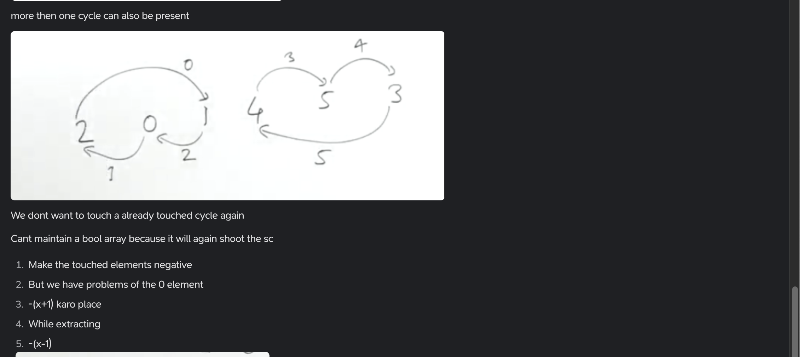

https://dashboard.programmingpathshala.com/renaissance/practice/question?questionId=20&sectionId=1&moduleId=1&topicId=1&subtopicId=14&assignmentId=3


    // v[i]=j

    //in the transformed array
    // v[j]=i
        
    //v[v[i]]=i


```python
vector<int> tmp(n);
for(int i=0;i<n;i++){
    tmp[v[i]]=i;
}
```

# Doing it in constant space


### Not usual method


Placing such a number which represents both the old values and the new value





```python
vector<ll> v(n);
//v[v[i]]=i
for(int i=0;i<n;i++){
    v[v[i]%n]=(ll)(n*i)+v[v[i]%n];
}
```

```python
for(int i=0;i<n;i++){
    cout<<v[i]/n<<" ";
} 
cout<<'\n';

```

# The start of cycle concept


pehala element 1 hain, element at 1 index should me made 0 (us elemenet ka idx)      


```python
for(int i=0;i<n;i++){
    //start of a cycle
    if(v[i]>=0){
        //idx jaha par change hona hain
        //val jo change karni hain
        int idx=v[i],val=i;
        while(idx!=i){
            //jab tak wo khud ko nahi change karne 
            //ke stithi mein na aata
            int tmp=v[idx];
            v[idx]=-(val+1);
            val=idx;
            idx=tmp;
        }
        //you starting changing from i=idx=v[i]
        //you never changed first element of your cycle
        v[i]=-(val+1);
    }
}
```

```python
for(int i=0;i<n;i++){
    cout<<(-v[i]-1)<<" ";
} 
```

https://practice.geeksforgeeks.org/problems/rearrange-an-array-with-o1-extra-space3142/1?utm_source=gfg&utm_medium=article&utm_campaign=bottom_sticky_on_article


https://www.interviewbit.com/problems/rearrange-array/


v[i]=v[v[i]]


```python
vector<ll> tmp(n);
for(int i=0;i<n;i++){
    tmp[i]=v[v[i]];
}
//isme agar CP site problem hoti to seedhe print heen kar dete
```

```python
//v[i]=v[v[i]]
for(int i=0;i<n;i++){
    v[i]=(v[v[i]%n]%n)*n + v[i]%n;
}
for(int i=0;i<n;i++){
    v[i]=v[i]/n;
}  
```
