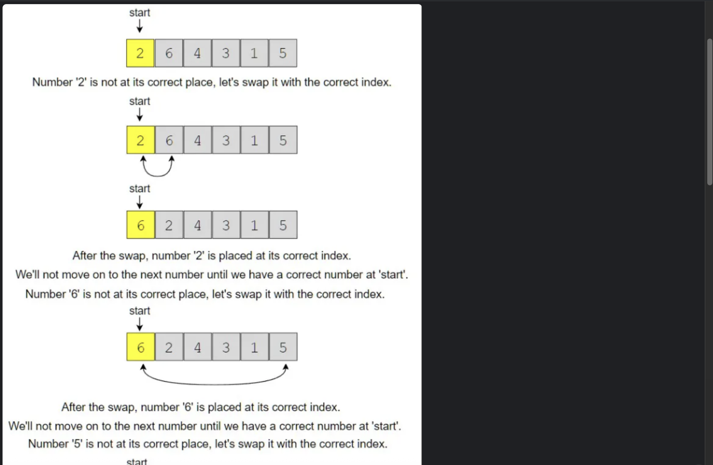

Sort an array of 1 to n 


https://www.designgurus.io/course-play/grokking-the-coding-interview/doc/6393a98bd8a93f4bff961b4d





```python
//The process described above can be written as
//O(n) 
for(int i=0;i<n;i++){
    while(v[i]!=i+1){
        int idx=v[i]-1;
        swap(v[i],v[idx]);
    }
}
```

```python
//generic method learned at lesson one
vector<int> sort(vector<int> &v) {
    int n=v.size();
    for(int i=0;i<n;i++){
      if(v[i]!=i+1){
        int idx=v[i]-1;
        int val=v[i];
        while(idx!=i){
          int tmp=v[idx];
          v[idx]=val;
          idx=tmp-1;
          val=tmp;
        }
        v[i]=val;  
      }
    }
    return v;
  }
```
