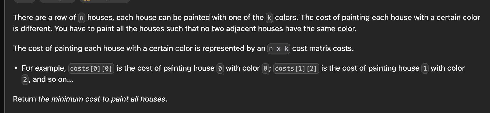

https://leetcode.com/problems/paint-house     
premium problem





```python
int f(int idx, int prevColor, vector<vector<int>>& ma){
    if(idx<0) return 0;
    int minn=INT_MAX;
    if(prevColor==0) minn=min(ma[idx][1]+f(idx-1,1,ma),ma[idx][2]+f(idx-1,2,ma));
    else if(prevColor==1)  minn=min(ma[idx][0]+f(idx-1,0,ma),ma[idx][2]+f(idx-1,2,ma));
    else  minn=min(ma[idx][1]+f(idx-1,1,ma),ma[idx][0]+f(idx-1,0,ma));
    return minn;
}

int minCost(vector<vector<int>>& ma) {
    int n=ma.size();        
    return min({f(n-1,0,ma),f(n-1,1,ma),f(n-1,2,ma)});
}
```

```python
int minCost(vector<vector<int>>& ma) {
    int n=ma.size();        
    vector<vector<int>> dp(n+1,vector<int>(3));
    dp[0][0]=dp[0][1]=dp[0][2]=0;
    for(int i=1;i<=n;i++){
        dp[i][0]=ma[i-1][0] + min(dp[i-1][1],dp[i-1][2]);
        dp[i][1]=ma[i-1][1] + min(dp[i-1][0],dp[i-1][2]);   
        dp[i][2]=ma[i-1][2] + min(dp[i-1][0],dp[i-1][1]);  
    }

    return min({dp[n][0],dp[n][1],dp[n][2]});
}
```

```python
int minCost(vector<vector<int>>& ma) {
    int n=ma.size();        
    vector<vector<int>> dp(n+1,vector<int>(3));
    dp[0][0]=dp[0][1]=dp[0][2]=0;
    for(int i=1;i<=n;i++){
        for(int j=0;j<3;j++){
            dp[i][j]=INT_MAX;
            for(int k=0;k<3;k++){
                if(k!=j) dp[i][j]=min(dp[i][j],dp[i-1][k]);
            }
            dp[i][j]+=ma[i-1][j];
        }
    }

    return min({dp[n][0],dp[n][1],dp[n][2]});
}
```

paint house 2    
premium problem


https://leetcode.com/problems/paint-house-ii/description/


```python
class Solution {
    public:
        int minCostII(vector<vector<int>>& ma) {
            int n=ma.size();        
            int colors=ma[0].size();
            vector<vector<int>> dp(n+1,vector<int>(colors,0));
            for(int i=1;i<=n;i++){
                for(int j=0;j<colors;j++){
                    dp[i][j]=INT_MAX;
                    for(int k=0;k<colors;k++){
                        if(k!=j) dp[i][j]=min(dp[i][j],dp[i-1][k]);
                    }
                    dp[i][j]+=ma[i-1][j];
                }
            }
            return *min_element(dp[n].begin(),dp[n].end());
        }
    };
```

any optimization possible?

