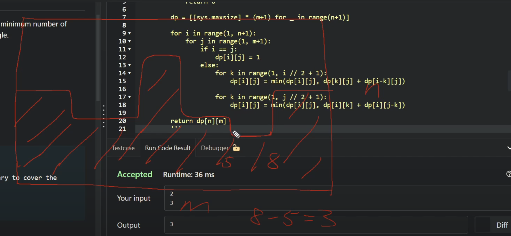

https://cses.fi/problemset/task/1744/





minimise moves, the result is all squares


you can always do it in m-1+ n-1 steps 


greedy wont work


observe how the length and bredth are a and b and how subtracting 1 from it changes it 


n and m are dimensions of the rectangle


base case     


```python
void solve()
{
  long long a,b;
  input(a,b);
  vvl dp(a+1,vl(b+1));
  for(long long i=1;i<=a;i++){
    for(long long j=1;j<=b;j++){
      if(i==j) dp[i][j]=0;
      else{
        ll minn=LLONG_MAX;
        for(long long k=1;k<=i-1;k++){
          minn=min(dp[k][j]+dp[i-k][j],minn);
        }
        for(long long k=1;k<=j-1;k++){
          minn=min(dp[i][k]+dp[i][j-k],minn);
        }
        dp[i][j]=1+minn;        
      }  
    }
  }
  print(dp[a][b]);
}
```

https://leetcode.com/problems/tiling-a-rectangle-with-the-fewest-squares/description/


cut into squares, such that the squares are minimized


why this solution is incorrect?


```python
class Solution {
    public:
        int tilingRectangle(int a, int b) {
            vector<vector<int>> dp(a+1,vector<int> (b+1));
            for(int i=1;i<=a;i++){
                for(int j=1;j<=b;j++){
                    if(i==j) dp[i][j]=1;
                    else{
                        int minn=INT_MAX;
                        for(int k=1;k<=i-1;k++){
                            minn=min(dp[k][j]+dp[i-k][j],minn);
                        }
                        for(int k=1;k<=j-1;k++){
                            minn=min(dp[i][k]+dp[i][j-k],minn);
                        }
                        dp[i][j]=minn;        
                    }  
                }
            }
            return dp[a][b];
        }
    };
```

The error in your code is not a bug in syntax but a flaw in the dynamic programming logic itself.

Your algorithm correctly finds the best way to tile a rectangle if you are only allowed to make "guillotine cuts"—cuts that go straight from one edge to the opposite edge.

However, the optimal solution for tiling a rectangle with squares does not always involve a guillotine cut. The arrangement of squares can be more complex.


# Actual solution


for each gap (starts with the minn height), try all possible squares 1*1 to 3* 3 


# Olympiad level

