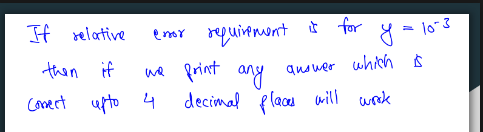

```python
long long double l=0,h=DBL_MAX,ans=-1;
int cnt=100;
while(cnt--){
    lld m=l+(h-l)/2;
    if(f(m)){
      ans=m;
      l=m;//moving right
      //or
      h=m;//moving left
    }
    else 
  }
cout<<fixed<<setprecision(6)<<ans<<nl;
```

```python
while(h-l>1e-6)
```



