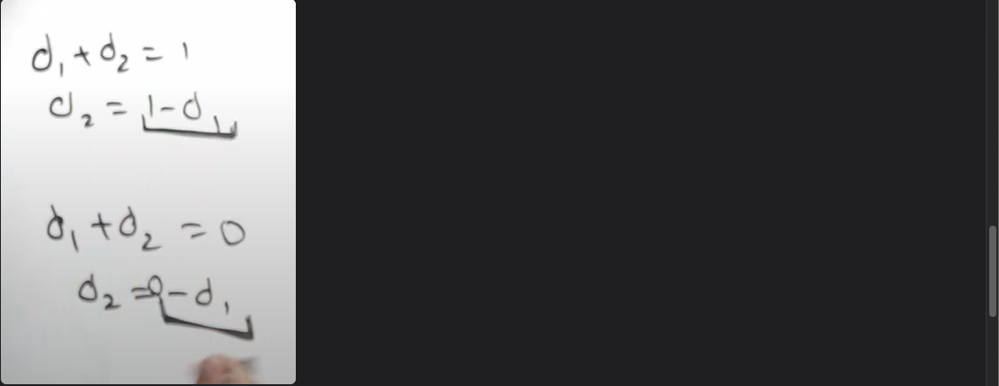

https://leetcode.com/problems/count-subarrays-with-median-k/description/


the elements are 1 to n   
For even elements, the left one is median





arrays containing k  


unable to understand handwriting  


new sol.    


```python
int n=v.size();
int idx=-1;
for(int i=0;i<n;i++){
    if(v[i]==k){
        idx=i;
        break;
        //all numbers between 1 and n are repeating only once
    }
}
if(idx==-1) return 0;

int diff1=0;
unordered_map<int,int> right;
for(int e=idx;e<n;e++){
    if(v[e]>k){
        diff1++;
    }
    else if(v[e]<k){
        diff1--;
    }
    right[diff1]++;
}

int diff2=0;
int ans=0;
for(int s=idx;s>=0;s--){
    if(v[s]>k){
        diff2++;
    }
    else if(v[s]<k){
        diff2--;
    }
    ans+=right[1-diff2];
    ans+=right[-diff2];     
}
return ans;
```
