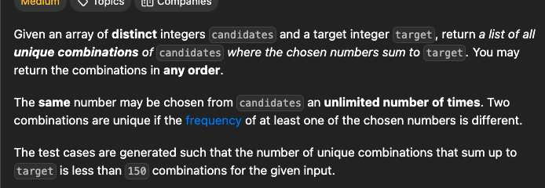

You can take an element any number of times


https://leetcode.com/problems/combination-sum/description/





```python
void f(vector<int> &tmp, vector<vector<int>> &ans, vector<int>& v, int k, int i){
    if(k==0){
        ans.push_back(tmp);
        return;
    }
    if(k<0 or i<0){
        return;
    } 
    //take, when take dont change the index
    //as we can take the same element again
    tmp.push_back(v[i]);
    f(tmp,ans,v,k-v[i],i);
    tmp.pop_back();

    //not take
    f(tmp,ans,v,k,i-1);
}

vector<vector<int>> combinationSum(vector<int>& v, int k) {
    vector<vector<int>> ans;
    vector<int> tmp;
    int n=v.size();
    f(tmp,ans,v,k,n-1);
    return ans;
}
```

https://leetcode.com/problems/combination-sum-ii/description/


Conatain repetitions, any number can be took only once


```python
void f(vector<int> &v, int idx, int k, vector<int> &tmp, vector<vector<int>> &ans){
    if(k==0){
        ans.push_back(tmp);
        return;
    }
    if(k<0 or idx==-1){
        return;
    } 

    //take
    tmp.push_back(v[idx]);
    f(v,idx-1,k-v[idx],tmp,ans);
    tmp.pop_back();

    //not take, for generating unique subsets
    //while skipping an element, skip all the same elements
    int val=v[idx];
    while(idx>=0 and v[idx]==val){
        idx--;
    } 
    f(v,idx,k,tmp,ans);
}


vector<vector<int>> combinationSum2(vector<int>& v, int k) {
    vector<vector<int>> ans;
    sort(v.begin(),v.end());
    //once sorted, all same elements will be together
    int n=v.size();
    vector<int> tmp;
    f(v,n-1,k,tmp,ans);
    return ans;
}
```
