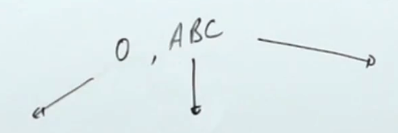

Generate permutations of a given array with distinct elements.





swapping the starting element with all the elements till the end


```python
void f(idx){
	if(idx==n-1){
		ans.pb(v);
		return;
	}
	for(int i=idx;i<n;i++){
		swap(s[idx],s[i]);
		f(i+1);
		swap(s[idx],s[i]);
	}
}
```
