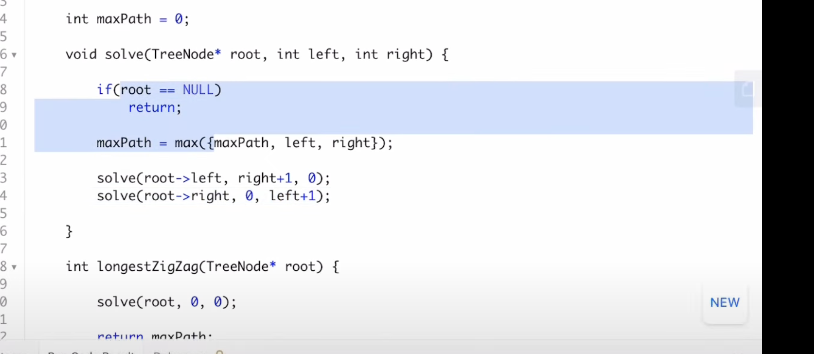

https://leetcode.com/problems/longest-zigzag-path-in-a-binary-tree/


Choose any node in the binary tree and a direction (right or left).
If the current direction is right, move to the right child of the current node; otherwise, move to the left child.


the zig-zag paths can terminate at non-leaf nodes also i.e. A node not having right child when we actually want it


unoptimized


```python
class Solution {
    public:
    
        void f(TreeNode* node, int dir, int &ans, int h, int &terminate){
            if(!node or terminate) return;
            ans=max(ans,h); 
            if(dir==0){
                f(node->left,1,ans,h+1,terminate);
            }
            else{
                f(node->right,0,ans,h+1,terminate);
            }
        }
    
        void ff(TreeNode* root, int &ans){
            int terminate=0;
            f(root,0,ans,0,terminate);//left
            f(root,1,ans,0,terminate);//right
        }
    
        void t(TreeNode* root, int &ans){
            if(!root) return;
            ff(root,ans);
            t(root->left,ans);
            t(root->right,ans);        
        }
    
        int longestZigZag(TreeNode* root) {
            int ans=0;
            t(root,ans);
            return ans;
        }
    };
```

the new path after switching direction should start with length 1 (the current edge you just took).

Right now, for example:
If you go from a node to its right child after coming from the left, you’re calling:

cpp
Copy
Edit
t(node->right, 0, 1, ans);
which says "path length is 0", when in fact it should be 1 because you’ve taken one step in the zigzag.





# Optimal


```python
class Solution {
    public:
        void t(TreeNode* node, int h, bool goLeft, int &ans){
            if(!node) return;
            ans=max(ans,h);
            if(goLeft){
                t(node->left, h+1, 0, ans);
                t(node->right, 1, 1, ans);            
            }
            else{
                t(node->left, 1, 0, ans);
                t(node->right,h+1, 1, ans);
            }
        }
    
        int longestZigZag(TreeNode* root) {
            int ans=0;
            t(root,0,0,ans);
            t(root,0,1,ans);        
            return ans;
        }
    };
```


some doubt when it is not correct


