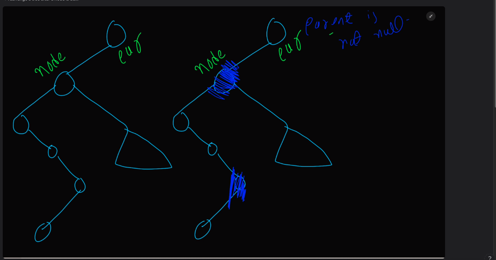

delete





Largest node of a bst


```python
Node* maxNode(Node* root){
    while(root->right){
        root=root->right;
    }
    return root; 
}
```

```python
pair<Node*, Node*> maxNode(Node* root, Node* par){
    Node* pred=root;
    Node* predPar=par;
    while(pred->right){
        predPar=pred;
        pred=pred->right;
    }
    return {pred,predPar}; 
}
```


```python
deleteLeaf(Node*node, Node*par){
    if(par->left==node) par->left=nullptr;
    else par->right=nullptr;
    return node;
}
//what if we dont return the node
```

deleteSingleChildNode();


```python

```

deleteDoubleChildNode()


```python
Node* deleteDoubleChild(Node*node, Node*par){
    //dont call it directly for roots
    pair<Node*, Node*> p=maxNode(node->left,node);
    Node* pred=p.first;
    Node* predPar=p.second;
    Node* attach=nullptr;
    if(isLeaf(pred)) attach=deleteLeaf(pred,predPar);
    else attach=deleteSingleChild(pred,predPar);
    //root node deletion will have par equals to null
    if(par and par->right==node) par->right=attach;
    else if(par and par->left==node) par->left=attach;
    attach->left=node->left;
    attach->right=node->right;
    node->left=nullptr;
    node->right=nullptr;
    return node;
}
```
