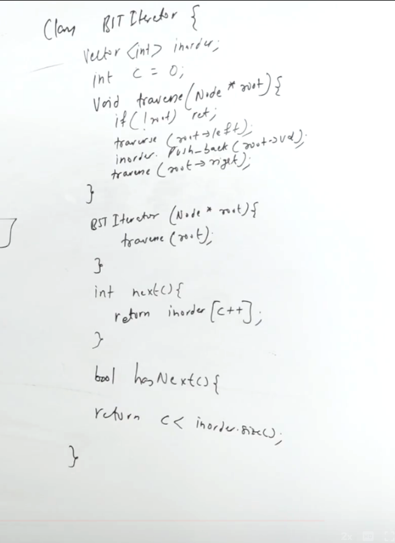

https://leetcode.com/problems/binary-search-tree-iterator/description/


```python
/**
 * Definition for a binary tree node.
 * struct TreeNode {
 *     int val;
 *     TreeNode *left;
 *     TreeNode *right;
 *     TreeNode() : val(0), left(nullptr), right(nullptr) {}
 *     TreeNode(int x) : val(x), left(nullptr), right(nullptr) {}
 *     TreeNode(int x, TreeNode *left, TreeNode *right) : val(x), left(left), right(right) {}
 * };
 */
class BSTIterator {
    public:
        BSTIterator(TreeNode* root) {
            
        }
        
        int next() {
            
        }
        
        bool hasNext() {
            
        }
    };
    
    /**
     * Your BSTIterator object will be instantiated and called as such:
     * BSTIterator* obj = new BSTIterator(root);
     * int param_1 = obj->next();
     * bool param_2 = obj->hasNext();
     */
```




Our bst will pass the root, it will use the class written by you


# MAANG constant space

discussed by ppa

