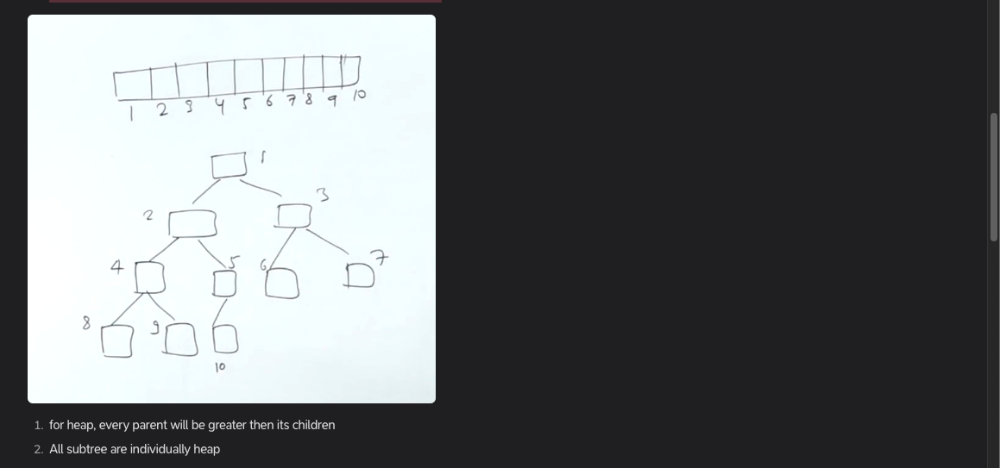

array is stored as a binary tree
Not necessary a sorted array
Till now we have implemented trees using pointers
Each root to leaf path will be sorted
We will implement the array as a tree usig the below formulae





0 based indexing, the numbers are just the elements 


parent of node having idx (idx-1)//2


Binary Tree -> HEAP     
    


The binary tree will be Complete binary tree (filled level by level from left to right)
For such a tree there is a only one node which has one chldren, rest of all nodes have either 2 children or 0 children (leaves)
There will be n//2 nodes (which have 2 or 1 children) and n//2 leave nodes


BST -> HEAP    
 https://www.geeksforgeeks.org/problems/bst-to-max-heap/1 


```python

```


