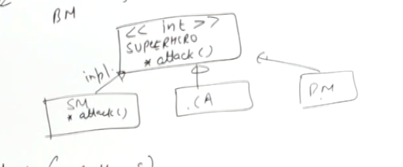

```python

```

open closed principle

a class open for : extension

exisiting facility can be extended


closed for :  modification  
(the other modules which are getting modified)





suppose now we can pass an array of super Heroes and we will attack by each of the super hero


Till now after dong lld, you find the solution


lot of code change when you introduce a new superhero as of now, changes in multiple modules


this is tight depedency


