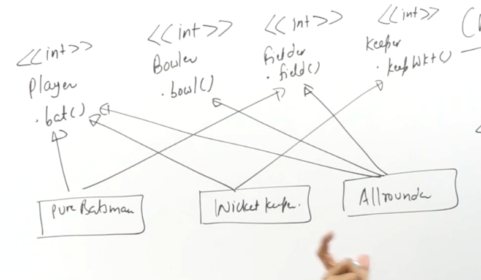

```python

```

Interface segregation


remedy of Liskov Substitution, tiny interface instead of fat interface, so whoever is inheriting it have not to forcefully implement the functions


Another def which I cannot understand  
Clients shouldnt depend upon methods they dont use  


By client we mean these concrete classess   





   
 


do it commpletely from 22:00


The client side only need to know about the interfaces in the first line


```python

```
