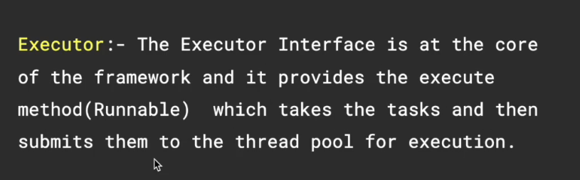

# Thread Death
buggy thread can throw an exception and kill the thread?  


# Executor Service


Design benefit: Decouples task submission from task execution


```python
        ExecutorService executorService=
            Executors.newFixedThreadPool(5);
        //Like factory method
```

```python
Worker worker1= new Worker();
Worker worker2= new Worker();
Worker worker3= new Worker();
Worker worker4= new Worker();
Worker worker5= new Worker();

executorService.submit(worker1);
executorService.submit(worker2);
executorService.submit(worker3);
executorService.submit(worker4);
executorService.submit(worker5);


// This method does not wait for previously submitted tasks to complete execution.
// Use awaitTermination to do that
executorService.shutdown();

```


# Executor interface?    
see the project


