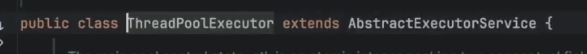
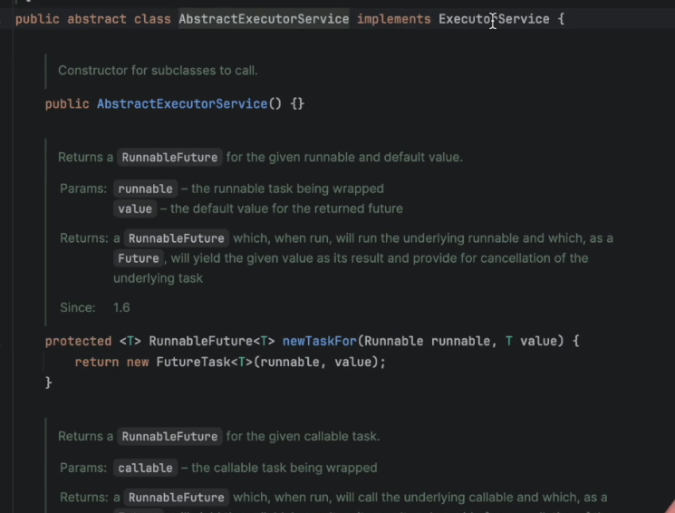

?


```python
        ExecutorService executorService=
            Executors.newFixedThreadPool(5);
        //Like factory method
```


```python
ExecutorService executorService=
Executors.newFixedThreadPool(5);
//Like factory method
```




