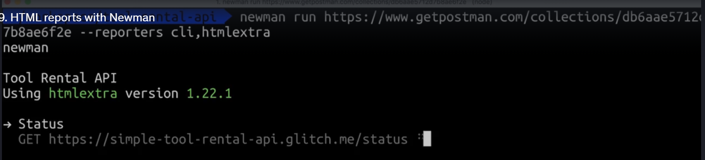

cli tool to run postan collection

install node for sonarQube yaml analysis and running this tool

See abdul commits for how he created those

the shared thing does not get updated in real time

# postman also provide its api  

this is for real time syncing

# HTML report with newman

