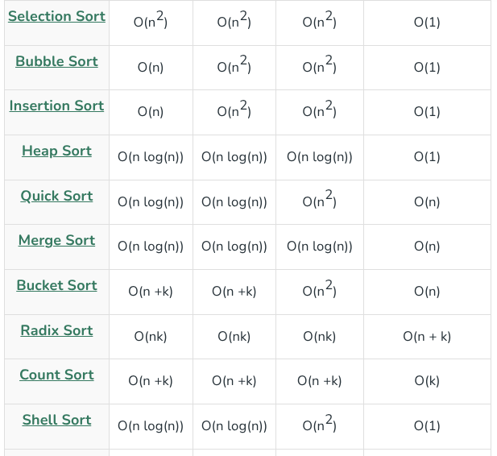
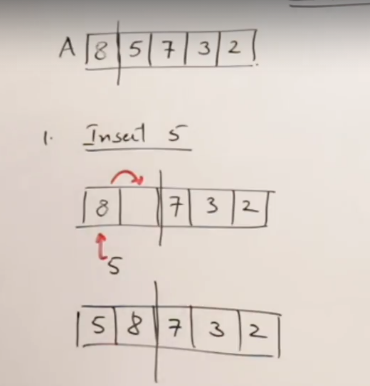

# TC



# Bubble sort

1. Iteration 1/ Pass 1
2. n-1 pairwise comparisons
3. Biggest element/biggest bubble in the end


```cpp
class Solution {
public:
    vector<int> sortArray(vector<int>& v) {
        //Bubble sort
        int n=v.size();
        for(int iter=1;iter<=n-1;iter++){
            //no. of swaps== n-iter
            int sorted =1;
            for(int noOfSwaps=1;noOfSwaps<=n-iter;noOfSwaps++){
                if(v[noOfSwaps-1]>v[noOfSwaps]){
                    swap(v[noOfSwaps-1],v[noOfSwaps]);
                    sorted=0;
                }
            }
            if(sorted){
                break;
            }
        }
        return v;
    }
};
```

# Insertion sort



1. First Pass


2. Intermediate results will not give any useful results

```
class Solution {
public:
    vector<int> sortArray(vector<int>& v) {
        //Insertion sort
        int n=v.size();
        for(int idx=1;idx<n;idx++){
            int i=idx-1;
            int curr=v[idx];
            while(i>=0 and v[i]>curr){
                v[i+1]=v[i];
                i--;
            }
            i++;
            v[i]=curr;
        }

        return v;
    }
};
```

# Selection sort


1. n-1 passes
2. i is standing on the current element
3. k is standing on the current smallest elemenet 
4. j is search for an element smaller then k
5. We get useful results


This is the algorithm which sorts the the array with the min. no. of swaps

```
class Solution {
public:
    vector<int> sortArray(vector<int>& v) {
        //Selection sort
        int n=v.size();
        for(int idx=0;idx<=n-2;idx++){
            int i=idx;
            for(int j=idx;j<n;j++){
                if(v[j]<v[i]){
                    i=j;
                }
            }
            swap(v[idx],v[i]);
        }

        return v;
    }
};
```

