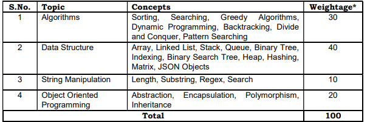

1. Sorting
2. Searching
3. Greedy
4. DP
5. Backtracking
6. Divide and Conquer
7. Pattern Searching
8. Array
9. LL
10. Stack
11. Queue
12. BT
13. Indexing
14. BST
15. Heap
16. Hashing
17. Matrix
18. JSON objects
19. String
    1. substring
20. Regex
21. Abstraction
22. Enscapsulation
23. Polymporphism
24. Inheritance

# Go Classes
# SEBI editor