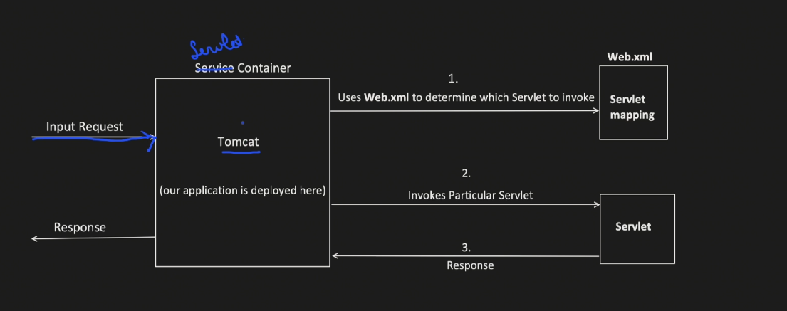
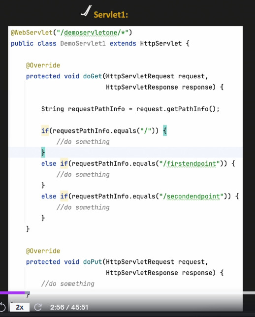
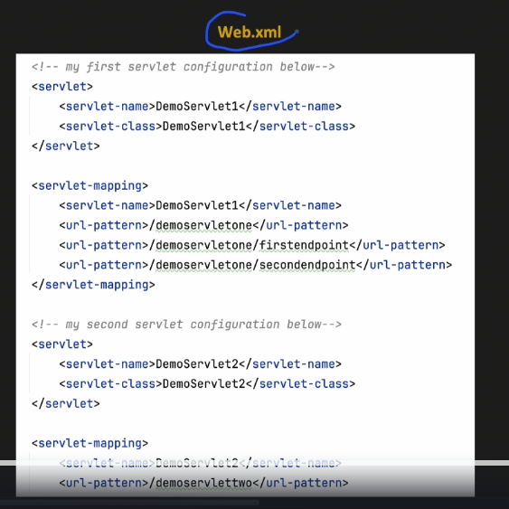

Servlet is a java class

1. handles client request
2. process it
3. generate response
4. Servlet Container manages the servlet
5. Spring and SpringBoot internally uses the same concepts
6. There can be so many servlets

Our all the servlets are converted into war and deployed to Tomcat

# Code of servlet

1. A servlet can have only one doGet, doPut, doPost, doDelete method
2. We have to override and implement these methods
3. Inside there can be more pattern checks for endpoints

# Web.xml

- Also holds filtering logic?
-
