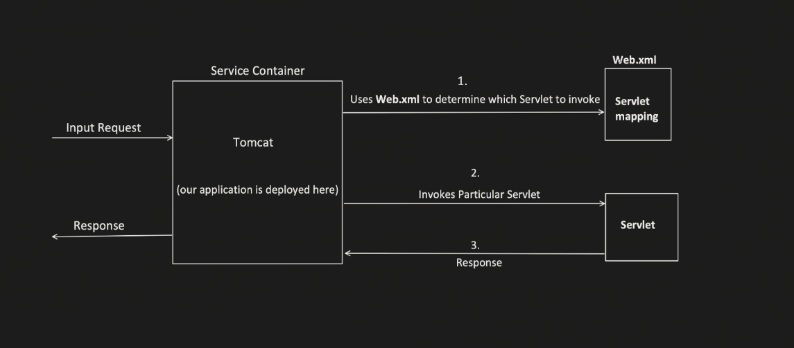

1. Servlet is a java class

   1. handles client request
   2. process it
   3. generate response
2. Servlet Container manages the servlet
3. 2013-15
4. Spring and SpringBoot internally uses the same concepts
5. There can be so many servlets

   
