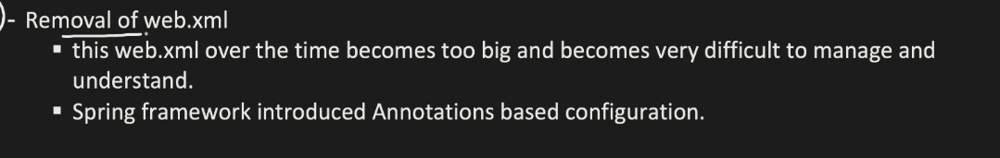

# How Spring solves the Servlet Problems

Spring addressed this issue by moving configuration from a central XML file directly into the Java classes themselves using **Annotations** and **Java-based Configuration** .
