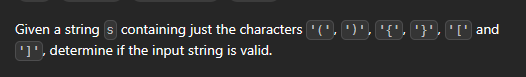

# Many brackets
[Minimum Add to Make Parentheses Valid - LeetCode](https://leetcode.com/problems/minimum-add-to-make-parentheses-valid/)
[Just a moment...](https://leetcode.com/problems/minimum-remove-to-make-valid-parentheses/description/)
[Just a moment...](https://leetcode.com/problems/minimum-insertions-to-balance-a-parentheses-string/description/)
[
](https://leetcode.com/problems/score-of-parentheses/description/)


https://leetcode.com/problems/valid-parentheses/
1. many patterns of questions



```cpp
bool isValid(string s) {
    stack<char> st;
    for(char &c:s){
        if(c=='(' or c=='{' or c=='[') st.push(c);
        else{
                if(st.empty()) return 0;
                else if((st.top()=='(' and c==')') or (st.top()=='{' and c=='}') or (st.top()=='[' and c==']')) st.pop();
                else return 0;           
        }
    }
    return st.empty();
    
}
```
