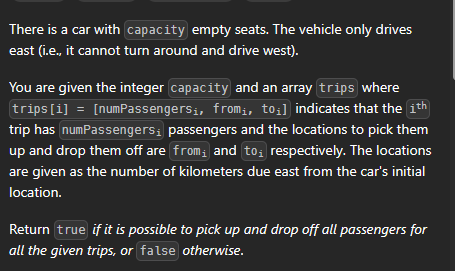

Aa there is only 1000 stops
```cpp
bool carPooling(vector<vector<int>>& trips, int capacity) {
    int stops[1001]={0};
    for(auto t: trips){
        stops[t[1]]+=t[0];
        stops[(t[2]-1)+1]-=t[0];
    }

    if(stops[0]>capacity) return 0;
    for(int i=1;i<=1000;i++){
        stops[i]+=stops[i-1];
        if(stops[i]>capacity) return 0;
    } 
    return 1;
}
```

# By heap
```cpp
  bool carPooling(vector<vector<int>>& trips, int capacity) {
  priority_queue< vector<int>, vector<vector<int>>, greater<vector<int>>> pq;
  for(auto t: trips){
      pq.push({t[1],t[0]});
      pq.push({t[2],-t[0]});
  }
  int onboard=0;
  while(!pq.empty()){
      onboard+=pq.top()[1]; pq.pop();
      if(onboard>capacity) return 0; 
  }
  return 1;
}
```
