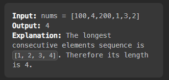
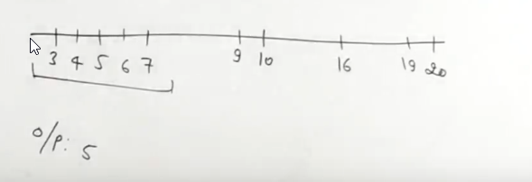
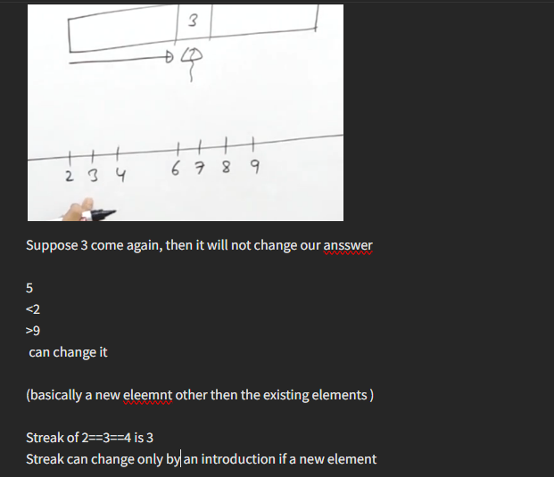
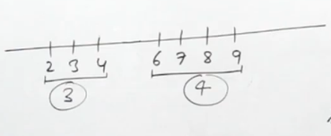
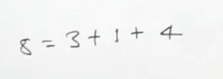
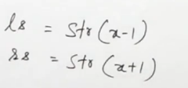
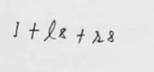
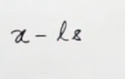
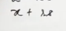

[Longest Consecutive Sequence - LeetCode](https://leetcode.com/problems/longest-consecutive-sequence/)

Remember the question have nothing to do with the length of the subsequence, it has only to do with the length of the largest sequence present




# Duplicates will not alter the result

=> doing it with the function also
# Brute force
## remove duplicates
## Sort the array
## check for consecutives

# By vector and set
```cpp
#define it(v) v.begin(), v.end()
class Solution {
public:
    int longestConsecutive(vector<int>& v) {
        int n=v.size();
        if(n==0) return 0;
        set<int> se(it(v));
        int ans=1,buff=1;
        auto it=se.begin();
        auto prev=it;
        it++;
        while(it!=se.end()){
            if(*it-*prev==1){
                buff++;
                ans=max(ans,buff);
            }
            else buff=1;
            prev=it;
            it++;
        }
        return ans;

    }
};
```  


# by only set
```cpp
#define it(v) v.begin(), v.end() 
class Solution { 
public: 
    int longestConsecutive(vector<int>& v) { 
        int n=v.size(); 
        if(n==0) return 0; 
        set<int> se(it(v));
        vector<int> tmp(it(se)); 
        int ans=1,curr_len=1;
        for(int i=1;i<tmp.size();i++){
            if(tmp[i]-tmp[i-1]==1){
                curr_len++;
                ans=max(ans,curr_len);
            }
            else curr_len=1;
        } 
        return ans; 
    } 
};
```

## O(maxx-minn)
```cpp
class Solution {  
public:  
#define it(v) v.begin(),v.end()  
    int longestConsecutive(vector<int>& v) {  
        unordered_map<int,int> um;  
        int n=v.size();  
        if(n==0) return 0;  
        int maxx=*max_element(it(v)),minn=*min_element(it(v));  
        for(auto &x:v) um[x]++;  
        int ans=0,cnt=0;  
        for(int i=minn;i<=maxx;i++){  
            if(um.count(i)) {  
                cnt++;  
                ans=max(ans,cnt);  
            }  
            else cnt=0;  
        }  
        return ans;  
    }  
};
```

# Without using extra space but high TC

```cpp
bool ls(vector<int>& v, int k){
    for(int &x: v) if(x==k) return 1;
    return 0;
}

int longestConsecutive(vector<int>& v) { 
    int n=v.size(); 
    if(n==0) return 0; 
    int ans=1; 
    for(int x: v){
        int len=1;
        while(ls(v,x+1)){
            x++;
            len++;
            ans=max(ans,len);
        }
    }
    return ans; 
} 
```

# Optmizing it by set
```cpp
bool ls(unordered_set<int>& se, int k){
    return se.count(k);
}

int longestConsecutive(vector<int>& v) { 
    int n=v.size(); 
    if(n==0) return 0;
    unordered_set<int> se(v.begin(),v.end()); 
    int ans=1; 
    for(int x: se){
        if(!se.count(x-1)){        
            int len=1;
                while(ls(se,x+1)){
                    x++;
                    len++;
                    ans=max(ans,len);
                }
            }
    }
    return ans; 
}
```


# Just sorting, not removing dupicates by set

```cpp
int longestConsecutive(vector<int>& v) {
    int n=v.size(); 
    if(n==0) return 0; 
    int ans=1; 
    sort(v.begin(),v.end());
    int curr_len=1,lastSmaller=INT_MIN;
    for(int &x: v){
        if(x-1==lastSmaller){
            curr_len++;
            ans=max(ans,curr_len);
            lastSmaller=x;
        }
        else if(x!=lastSmaller){
            curr_len=1;
            lastSmaller=x;
        }  
    }
    return ans;
}
```

# Optimal O(n) TC O(1) space
# Ppa evernote








### Borders




Updating the internal elements are not important

```cpp
int longestConsecutive(vector<int>& v) {
    unordered_map<int,int> um;
    int n=v.size(),ans=0;
    if(n==0) return 0;
    for(auto &x:v){
        if(um.count(x)) continue;
        int ls=0,rs=0;
        if(um.count(x-1)) ls=um[x-1];
        if(um.count(x+1)) rs=um[x+1];
        int ps=um[x]=um[x-ls]=um[x+rs]=1+ls+rs;
        ans=max(ans,ps);
    }

    return ans;
}
```

# Finding the starting points of the chunk
1. X is a start of chunk if x-1 is not present

```cpp
int longestConsecutive(vector<int>& v) {
    unordered_map<int,int> m,vis_chunk_starters;
    int ans=0;
    for(auto &x:v) m[x];
    for(auto &x:v){
        if(m.count(x-1)) continue;
        if(vis_chunk_starters.count(x)) continue;
        vis_chunk_starters[x];
        int cnt=0;
        while(m.count(x)){
            cnt++;
            ans=max(ans,cnt);
            x++;
        }
    }
    return ans;
}
```
