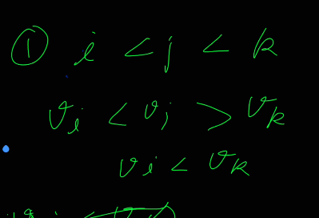
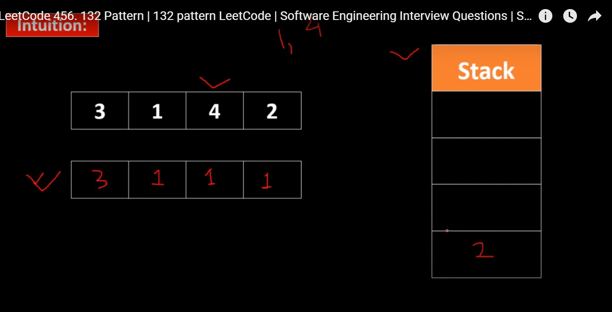
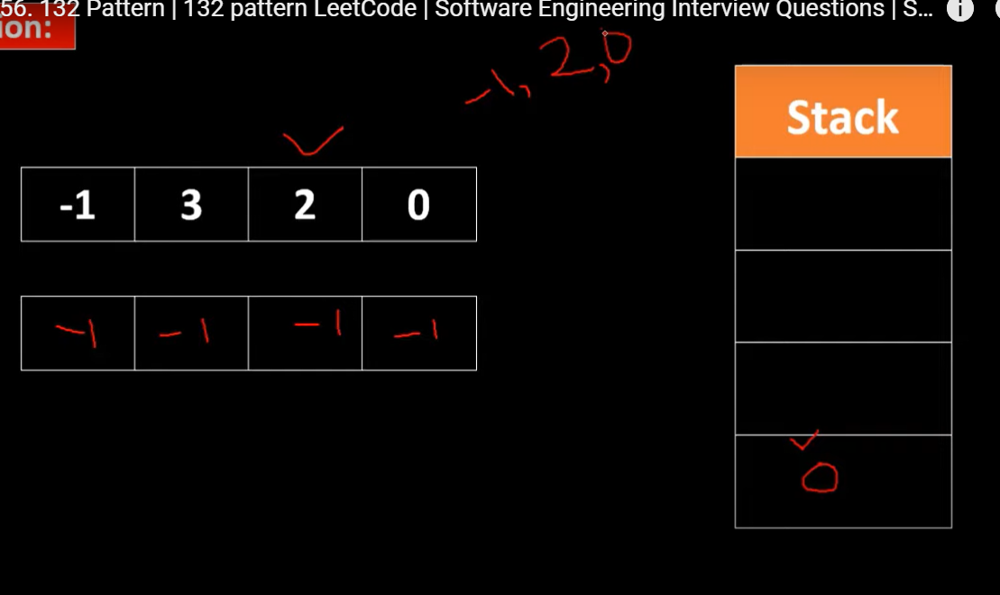
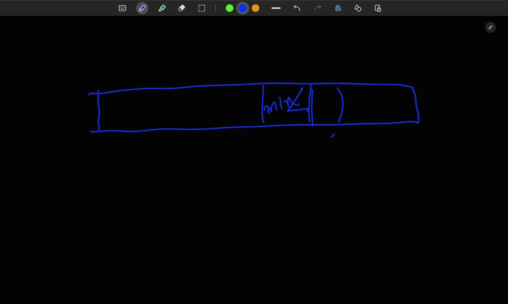
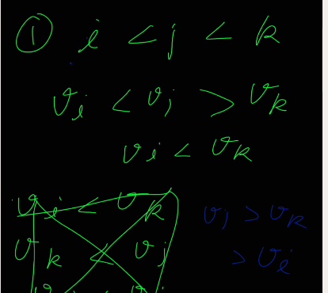

[LeetCode 456. 132 Pattern | 132 pattern LeetCode | Software Engineering Interview Questions | Stacks - YouTube](https://www.youtube.com/watch?v=S483HJ4pIg0)

```cpp
class Solution {
public:
bool find132pattern(vector<int>& v) {
    int n=v.size();
    if(n<3) return 0;
    stack<int> st;
    vector<int> pre(n);
    pre[0]=v[0];
    for(int i=1;i<n;i++) pre[i]=min(pre[i-1],v[i]);
    //vi is middle button
    //prei is left
    //right is in stack
    st.push(v[n-1]);
    for(int n2Idx=n-2;n2Idx>=1;n2Idx--){
        int n1=pre[n2Idx-1];
        //firt condition
        // n2>n1 (1)
        if(v[n2Idx]>n1){
            //we want n3 to be more then n1 n1<n3 (3)
            while(!st.empty() and st.top()<=n1){
                st.pop();
            } 
            //we wat st.top()==n3 to be  n3<n2 (2)
            if(!st.empty() and st.top()<v[n2Idx]){
                return 1;
            } 
            else{
                st.push(v[n2Idx]);
            } 
        }
    }
    return 0;
}
};
```

# Brute fo


[132 Pattern - LeetCode](https://leetcode.com/problems/132-pattern/)


[132 Pattern | Intuition explained | Brute Force | Better | Optimal  | META | AMAZON | Leetcode - 456 - YouTube](https://youtu.be/RZXxX1EU364?si=s7bU2rPls3wdZiXP)



# n^3
```cpp
if(n<3) return 0;
for(int i=0;i<n;i++){
    for(int j=i+1;j<n;j++){
        for(int k=j+1;k<n;k++){
            if(v[i]<v[j] and v[j]>v[k] and v[i]<v[k]) return 1;
            //if(v[j]>v[k] and v[i]<v[k])
        }
    }
}
return 0;
```

v[j]>v[k]>v[i] is sufficient


# n^2

```cpp
if(n<3) return 0;
int minn=v[0];
for(int i=1;i<n;i++){
    for(int j=i+1;j<n;j++){
        if(minn<v[i] and v[i]>v[j] and minn<v[j]) return 1;
    }
    minn=min(minn,v[i]);
}
return 0;
```


# Optimal linear





[LeetCode 456. 132 Pattern | 132 pattern LeetCode | Software Engineering Interview Questions | Stacks - YouTube](https://youtu.be/S483HJ4pIg0?si=LHMohgM_Fcr9Ynl8)




# Unable to understand
---------------------------------------------------------------------------------------------------------------------




```cpp
int n=v.size();
if(n<3) return 0;
stack<int> st;
int thirdElem=INT_MIN;
//while it is this we have not found our vl
  
for(int i=n-1;i>=0;i--){
    if(v[i]<thirdElem) return 1;
    while(!st.empty() and st.top()<v[i]){
        thirdElem=st.top();
        st.pop();
    }
    st.push(v[i]);
}
return 0;
```
