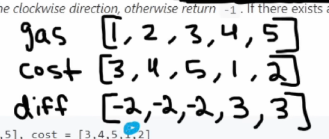

[Gas Station - LeetCode](https://leetcode.com/problems/gas-station/description/)





the first point in the array from which the sum can remain positive

```cpp
int canCompleteCircuit(vector<int>& g, vector<int>& c) {
    int n=g.size();
    vector<int> v(n);
    for(int i=0;i<n;i++){
        v[i]=g[i]-c[i];
    }
    if(accumulate(v.begin(),v.end(),0)<0) return -1;
    int ans=0, sum=0;
    for(int i=0;i<n;i++){
        sum+=v[i];
        if(sum<0){
            ans=i+1;
            sum=0;
        }
    }   
    return ans; 
}
```