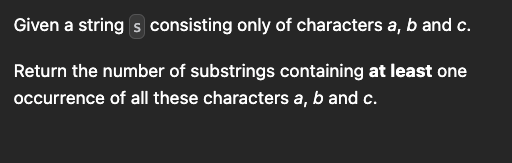

[Just a moment...](https://leetcode.com/problems/number-of-substrings-containing-all-three-characters/description/)



```cpp
int numberOfSubstrings(string s) {
    int n=s.size();
    int l=0,h=0;
    vector<int> m(3,0);
    int ans=0;
    while(h<n){ 
        m[s[h]-'a']++;
        while(m[0] > 0 && m[1] > 0 && m[2] > 0 and l<=h){
            ans+=n-h;
            m[s[l]-'a']--;
            l++;
        }
        h++;
    }
    return ans;
}
```