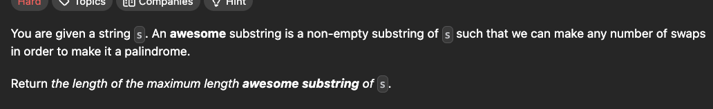
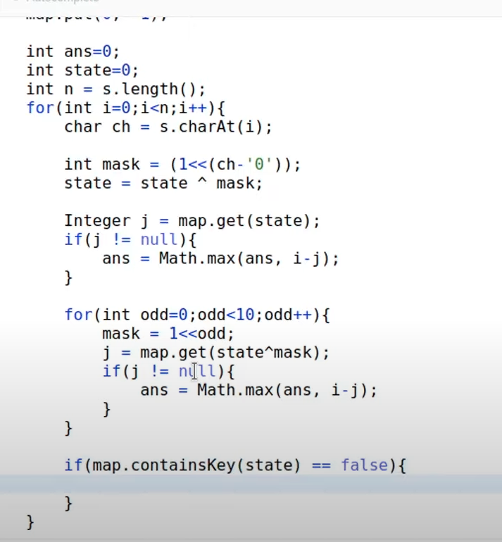
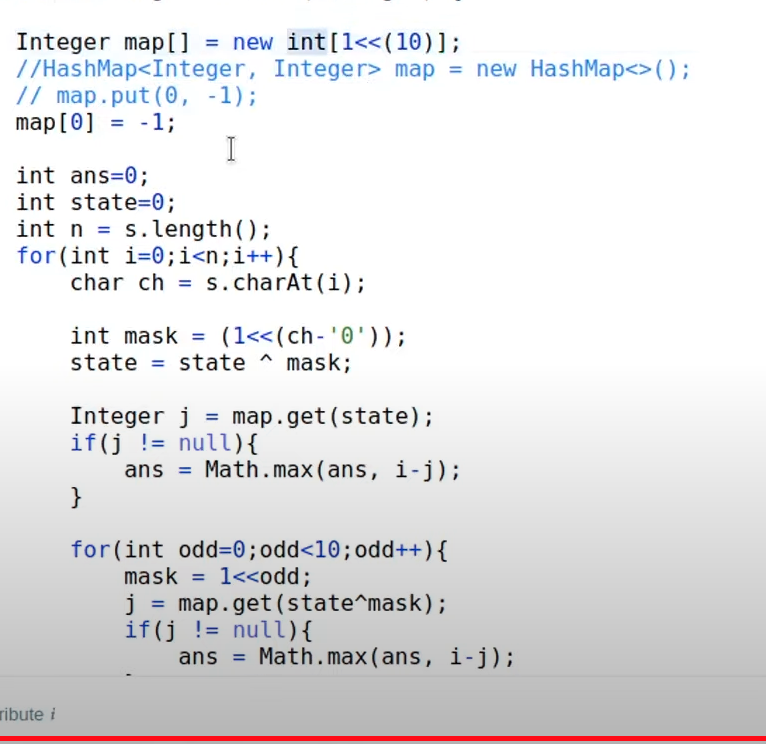
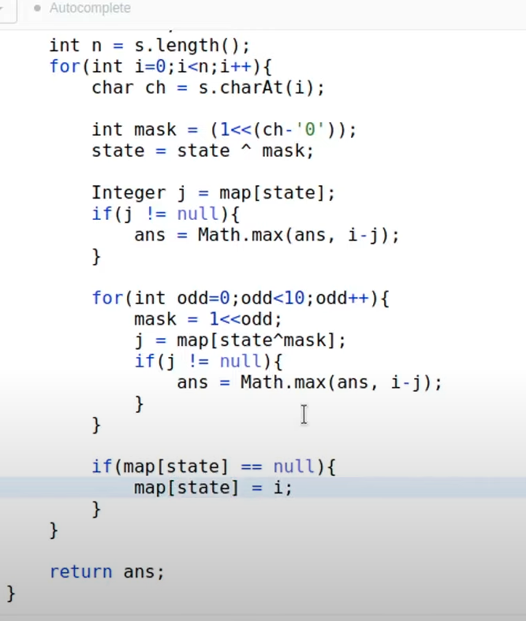

[Just a moment...](https://leetcode.com/problems/find-longest-awesome-substring/description/)



```cpp
int longestAwesome(string s) {
    unordered_map<int,int> m;
    m[0]=-1;//such that it accurately find the length
    int n=s.size();
    int mask=0;
    int ans=0;
    for(int i=0;i<n;i++){
        char c=s[i];
        mask^=(1<<(c-'0'));
        for(int d=0;d<=9;d++){
            int new_mask=mask^(1<<d);
            if(m.count(new_mask)) ans=max(ans,i-m[new_mask]);                
        }
        if(m.count(mask)) ans=max(ans,i-m[mask]);
        else m[mask]=i;
    }
    return ans;
}
```








