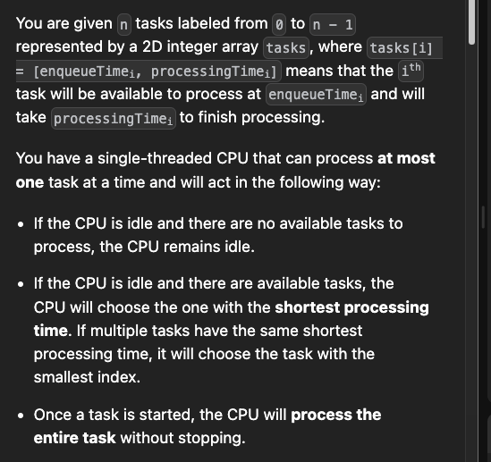

[Just a moment...](https://leetcode.com/problems/single-threaded-cpu/description/)

[Single-Threaded CPU - Priority Queue - Leetcode 1834 - Python - YouTube](https://youtu.be/RR1n-d4oYqE?si=3RntHaw0CzNxH_Nx)

[Single-Threaded CPU | Detailed Explanation | Google | Live Coding - YouTube](https://youtu.be/9zRXNLbl0FI?si=duSDp9_1dvxYXgok)


```cpp
vector<int> getOrder(vector<vector<int>>& origMat) {
    int n=origMat.size();
    vector<vector<int>> ma;
    for(int i=0;i<n;i++){
        ma.push_back({origMat[i][0],origMat[i][1],i});
    }
    sort(ma.begin(),ma.end());
    vector<int> ans;
    priority_queue< vector<int>, vector<vector<int>>,greater<vector<int>> > pq;
    int idx=0;
    long long curr_time=1;
    int no=n;
    while(no--){
        while(idx<n and ma[idx][0]<=curr_time){
            pq.push({ma[idx][1],ma[idx][2]});
            idx++;
        }
        if(pq.empty() and ma[idx][0]>curr_time and idx<n){
            curr_time=ma[idx][0];
            pq.push({ma[idx][1],ma[idx][2]});
            idx++;
        } 
        auto vv=pq.top();pq.pop();
        curr_time+=vv[0];
        ans.push_back(vv[1]);
    }
    return ans;
}
```


# Archieve
------------------------------------------------------------------------------------------------

```
1. first add indices to the input

2. Sort based on increasing order of time of arrival

3. Start with curr_time=0, initiate curr_time with TOA of the first process

4. Increment curr_time by the time it is taken to process the process 

5. Now, chekk which of the tasks have TOA less then curr_time, add them to priority queue

6. The first priority of priority_queue will be completion time, second idx (according to question)
```


```cpp
vector<int> getOrder(vector<vector<int>>& ma1) {
    int n=ma1.size();
    vector<vector<int>> ma2;
    for(int i=0;i<n;i++){
        ma2.push_back({ma1[i][1],ma1[i][0],i});
    }
    sort(ma2.begin(),ma2.end(),[](vector<int> &a, vector<int> &b){return a[1]<b[1];});
    vector<int> ans;
    priority_queue< vector<int>, vector<vector<int>>,greater<vector<int>> > pq;
    int idx=0;
    long long curr_time=0;
    while(idx<n or !pq.empty()){
        if(pq.empty() and curr_time<ma2[idx][1]) curr_time=ma2[idx][1];
        while(idx<n and ma2[idx][1]<=curr_time){
            pq.push({ma2[idx][0],ma2[idx][2]});
            idx++;
        }
        auto vv=pq.top();pq.pop();
        curr_time+=vv[0];
        ans.push_back(vv[1]);
    }

    return ans;
}
```