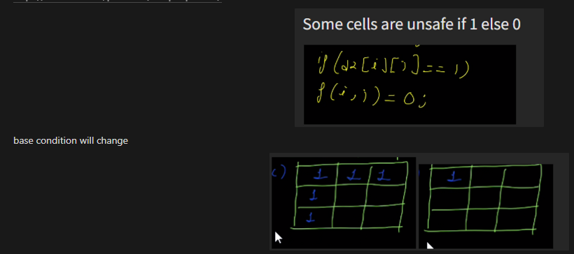

[leetcode.com](https://leetcode.com/problems/unique-paths/)



```cpp
  vector<vector<int>> dp(rr,vector<int> (cc,0)); 
  dp[0][0]= ma[0][0]==1 ? 0:1;  
  for(int r=0;r<rr;r++){ 
      for(int c=0;c<cc;c++){ 
          if(r==0 and c==0) continue;   
          if(ma[r][c]) continue;   
          int ans=0;   
          if(c>0) ans+=dp[r][c-1]; 
          if(r>0) ans+=dp[r-1][c]; 
          dp[r][c]=ans;  
      } 
  } 
  return dp[rr-1][cc-1]; 
```
