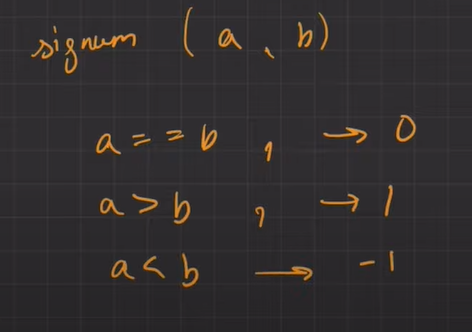

[Find Median from Data Stream - LeetCode](https://leetcode.com/problems/find-median-from-data-stream/description/)

odd n//2    7//2 3                 0 1 2 3 4 5 6
even  8//2 4                  0 1 2 3 4 5 6 7   n//2-1 and n//2


# Brute force

```cpp
class MedianFinder {
    vector<int> v;
public:
    MedianFinder() {
        
    }
    
    void addNum(int num) {
        v.push_back(num);
    }
    
    double findMedian() {
        sort(v.begin(),v.end());
        int n=v.size();
        return n&1?v[n/2]:(v[n/2]+v[n/2-1])*0.5;
    }
};
```

# insertion sort





# Two heaps
1.  All the numbers in the max-heap are smaller or equal to the top element of the max-heap (let's call it )
2.  All the numbers in the min-heap are larger or equal to the top element of the min-heap (let's call it )
1.  A max-heap `lo` to store the smaller half of the numbers
2.  A min-heap `hi` to store the larger half of the numbers
3. The max-heap `lo` is allowed to store, at worst, one more element more than the min-heap `hi`. Hence if we have processed  elements:

- If , then `lo` is allowed to hold  elements, while `hi` can hold  elements.
- If , then both heaps are balanced and hold  elements each.

This gives us the nice property that when the heaps are perfectly balanced, the median can be derived from the tops of both heaps. Otherwise, the top of the max-heap `lo` holds the legitimate median

```cpp
class MedianFinder {
    priority_queue<int> maxh;
    priority_queue<int,vector<int>,greater<int>> minh;
public:
    MedianFinder() {
    }
    //maxh minh
    void addNum(int x) {
        //steps to always maintain an order
        maxh.push(x);
        minh.push(maxh.top());
        maxh.pop();

        //maintain size
        if(maxh.size()<minh.size()){
            maxh.push(minh.top());
            minh.pop();
        }
    }
    
    double findMedian() {
        return maxh.size()>minh.size()?maxh.top():(maxh.top()+minh.top())*0.5;
    }
};

/**
 * Your MedianFinder object will be instantiated and called as such:
 * MedianFinder* obj = new MedianFinder();
 * obj->addNum(num);
 * double param_2 = obj->findMedian();
 */
```

# Multiset
```cpp
class MedianFinder {
    multiset<int,greater<int>> maxh;
    multiset<int> minh;
public:
    MedianFinder() {
    }
    //maxh minh
    void addNum(int x) {
        //steps to always maintain an order
        maxh.insert(x);
        minh.insert(*maxh.begin());
        maxh.erase(maxh.begin());

        //maintain size
        if(maxh.size()<minh.size()){
            maxh.insert(*minh.begin());
            minh.erase(minh.begin());
        }
    }
    
    double findMedian() {
        return maxh.size()>minh.size()?*maxh.begin():(*maxh.begin()+*minh.begin())*0.5;
    }
};

/**
 * Your MedianFinder object will be instantiated and called as such:
 * MedianFinder* obj = new MedianFinder();
 * obj->addNum(num);
 * double param_2 = obj->findMedian();
 */
```

 

# PBDS

```cpp
#include<ext/pb_ds/assoc_container.hpp>
#include<ext/pb_ds/tree_policy.hpp>
using namespace __gnu_pbds;
typedef tree<long long, null_type, less_equal<long long>, rb_tree_tag, tree_order_statistics_node_update> pbds; // find_by_order, order_of_key
class MedianFinder {
private:
     pbds A;
public:
    MedianFinder() {
    }
    
    void addNum(int num) {
        A.insert(num);
    }
    
    double findMedian() {
        int n= A.size();
        return n%2==0?0.5*(*A.find_by_order(n/2-1))+0.5*(*A.find_by_order(n/2)):(*A.find_by_order(n/2));
    }
};

```