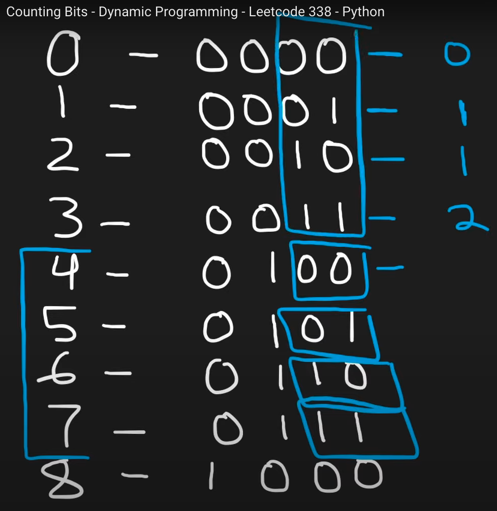
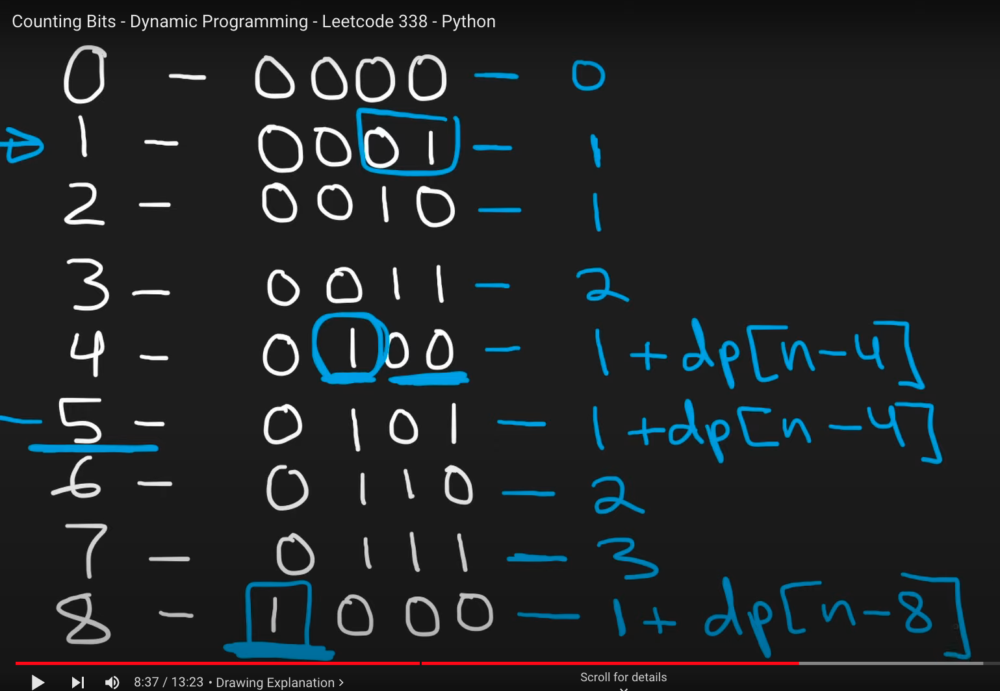
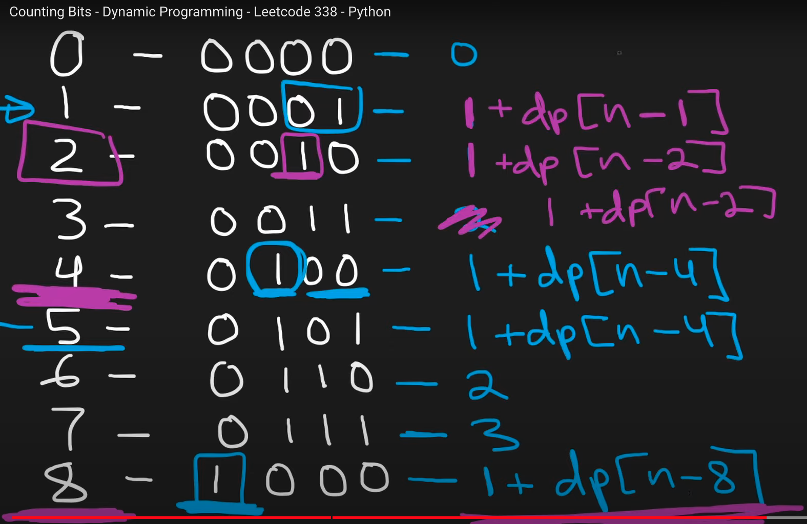

[Counting Bits - LeetCode](https://leetcode.com/problems/counting-bits/description/)

# Brute force n* logn
better then it

[Counting Bits - Dynamic Programming - Leetcode 338 - Python - YouTube](https://youtu.be/RyBM56RIWrM?si=y8EoXS4SOMyLoIz8)





```cpp
  vector<int> countBits(int n) {
      vector<int> ans(n+1);
      ans[0]=0;
      int offset=1;
      for(int i=1;i<=n;i++){
          if(offset*2==i) offset=i;
          ans[i]=1+ans[i-offset];
      }

      return ans;
  }
```


