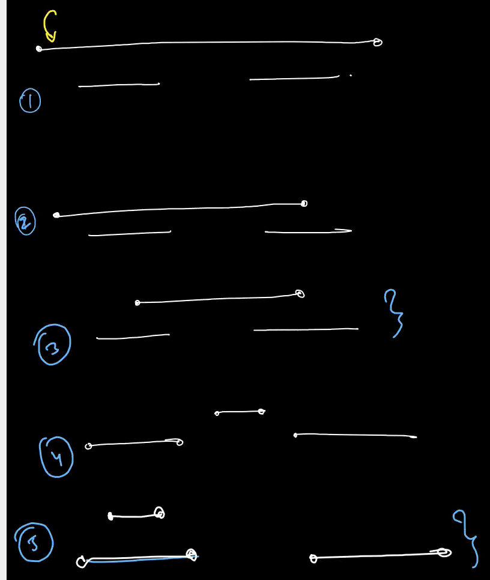
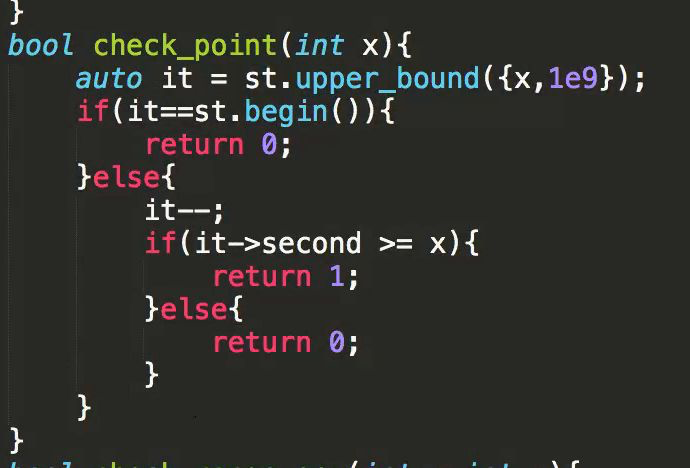
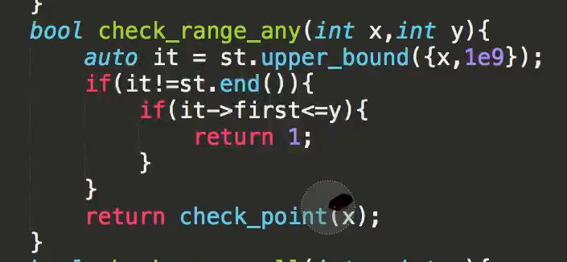
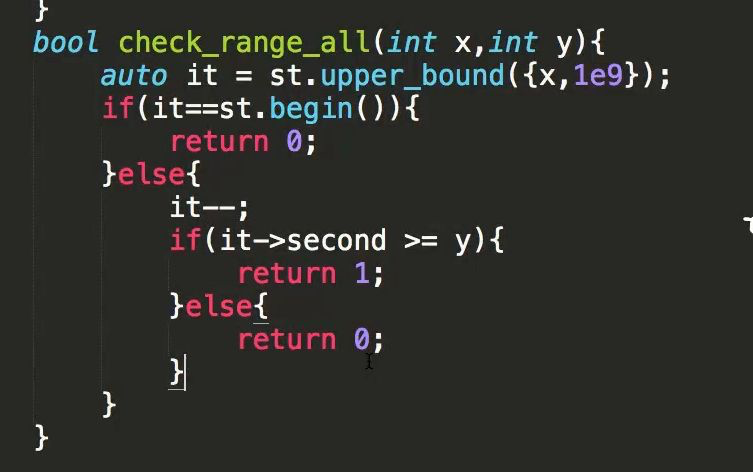
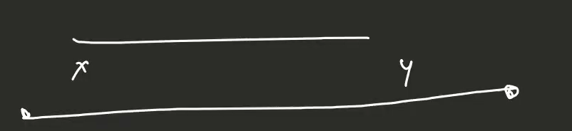
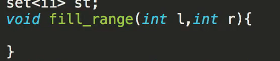
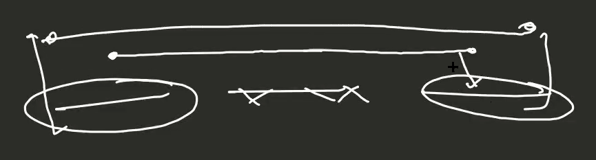
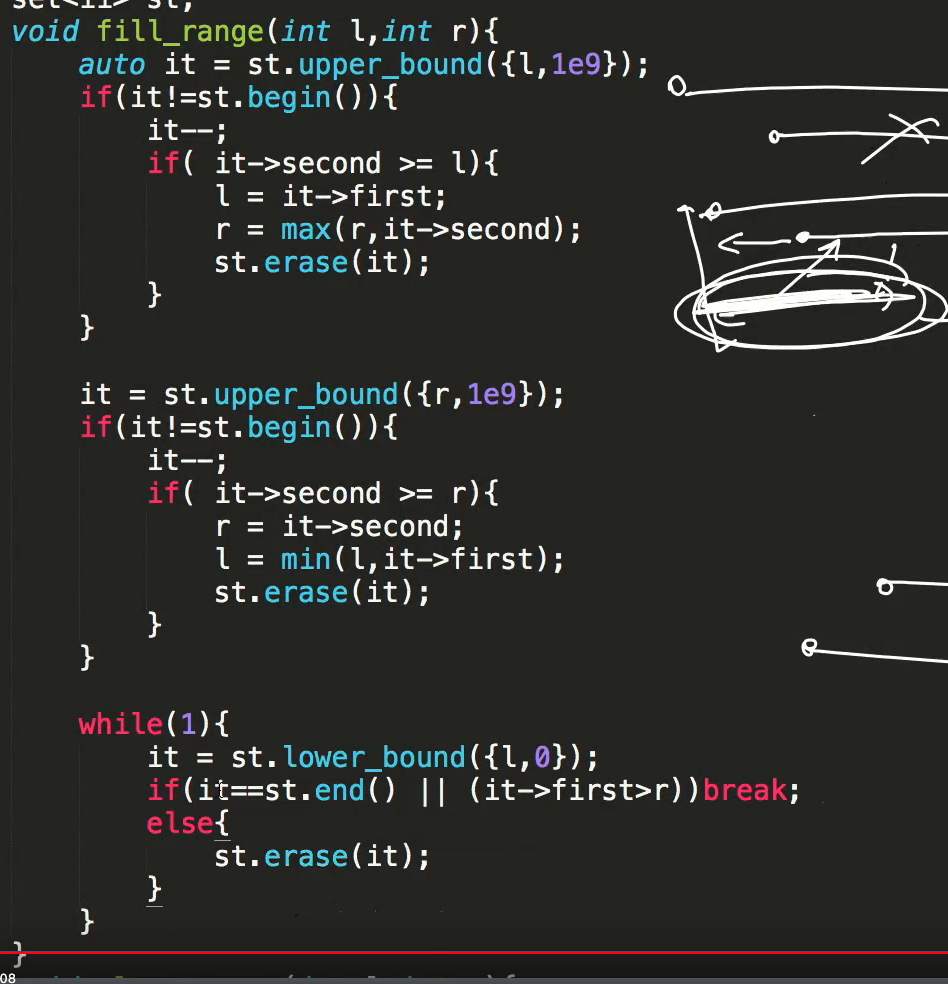

[715. Range Module](https://leetcode.com/problems/range-module/)

------------
# AZ











----------------------------------------------------------------------------------





  


------------------


1.  the logic you are referring to is only to check whether two intervals overlap
  
2.  *[*3:58 PM*]*
  it will fail on something like : existing ranges - (3,4), (7,10), (20,28) new add range = (5,22) something like this, you need to merge 7,10 and 20,28 with 5,22 and get a single 5,28
  
3.  *[*3:59 PM*]*
  this will actually have a much bigger implementation, taking the first index less than l, and first less than r, more or less similar to the one done for removerange
  
4.  *[*4:00 PM*]*
  its like, more than 1 interval can overlap with the new interval
  
5.  *[*4:00 PM*]*
  and you are referring to bool logic, in which you check only for 1 interval rather than all possible intervals (edited)
  
6.  *[*4:01 PM*]*
  the add range will be almost as complex as the removerange function


```cpp
class RangeModule {
    set<pair<int,int>> se;

    void insertInterval(int l, int r){
        pair<int,int> tmp1={l,INT_MIN};
        pair<int,int> tmp2={l,r};
        se.insert(se.upper_bound(tmp1),tmp2);
    }

    void merge(){
        set<pair<int,int>> merged;
        for(auto p:se){
            if(merged.empty() or merged.rbegin()->second<p.first )merged.insert(p);
            else{
                auto it=merged.end();
                it--;
                int l=it->first,r=max(it->second,p.second);
                merged.erase(it);
                merged.insert({l,r});
            } 
        }
        se=merged;
    }

    void book(int s, int e) {
        auto it = se.upper_bound({s,INT_MIN});
        if(it!=se.end()){
            if(it->first<=e){
                int tmp=it->second;
                se.erase(it);
                se.insert({s,max(tmp,e)});
                return;
            }
        }
        if(it!=se.begin()){
            auto it1 = it;
            it1--;
            if(it1->second>=s){
                int tmp=it1->first;
                int tmp1=it1->second;
                se.erase(it1);
                se.insert({tmp,max(tmp1,e)});
                return;
            }   
        }
        se.insert({s,e});
    }


public:
    RangeModule() {se.insert({INT_MAX, INT_MAX});}
    void addRange(int l, int r) {
        // insertInterval(l,r);
        // merge();
        book(l,r);
    }
    
    bool queryRange(int l, int r) {
        for(auto p: se){
            if(p.first<=l and r<=p.second) return 1;
        }
        return 0;
    }
    
    void removeRange(int l, int r) {
        auto left = se.lower_bound({l, INT_MAX});
        auto right = se.lower_bound({r, INT_MIN});
        if(left!=se.begin()) left--;
        if(right!=se.begin()) right--;
        if(left->first == INT_MAX) return;
        if(left==right){
            if(left-> second < l or left->first>=r){
                return;
            }
            if(left->first<l and left->second>=r){
                se.insert({left->first, l});
                se.insert({r,left->second});
                se.erase(left);
                return;
            }
            else if(left -> first >= l and left -> second < r) 
            {
                se.erase(left);
                return;
            }
            if(left -> first < l and left -> second <r){
                se.insert({left -> first, l});
                se.erase(left);
                return;
            }
            if(left -> first >= l and left -> second >= r){
                se.insert({r, left-> second});
                se.erase(left);
                return;
            }
        }
        else{
            if(left->first <= l and left -> second >= l){
                se.insert({left->first, l});
                se.erase(left);
                left++;
            }
            while(left!=right){
                if(left-> first>=l and left -> second <r)
                se.erase(left);
                left++;
            }
            if(right->second>=r){
                se.insert({r, right->second});
                se.erase(right);
            }
            else if
            (right -> first >= l and right->second < r) se.erase(right);
        }
        // merge();
    }

};

/**
 * Your RangeModule object will be instantiated and called as such:
 * RangeModule* obj = new RangeModule();
 * obj->addRange(l,r);
 * bool param_2 = obj->queryRange(l,r);
 * obj->removeRange(l,r);
 */
```

```cpp
class RangeModule {
    vector<vector<int>> ma;

    void insertInterval(int l, int r){
        vector<int> tmp1={l,INT_MIN};
        vector<int> tmp2={l,r};
        ma.insert(upper_bound(ma.begin(),ma.end(),tmp1),tmp2);
    }

    void merge(vector<vector<int>> &ma){
        vector<vector<int>> merged;
        for(auto interval:ma){
            if(merged.empty() or merged.back()[1]<interval[0]) merged.push_back(interval);
            else merged.back()[1]=max(merged.back()[1],interval[1]);
        }
        ma=merged;
    }

public:
    RangeModule() {}
    void addRange(int l, int r) {
        insertInterval(l,r);
        merge(ma);
    }
    
    bool queryRange(int l, int r) {

    }
    
    void removeRange(int l, int r) {
        
    }
};

/**
 * Your RangeModule object will be instantiated and called as such:
 * RangeModule* obj = new RangeModule();
 * obj->addRange(l,r);
 * bool param_2 = obj->queryRange(l,r);
 * obj->removeRange(l,r);
 */
```


----------


