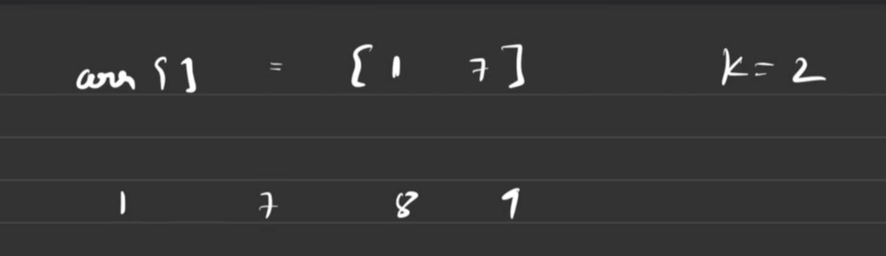
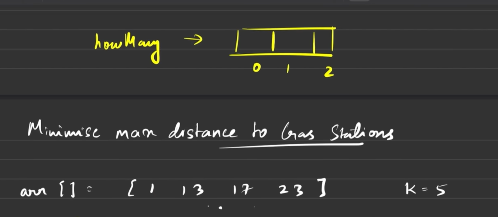
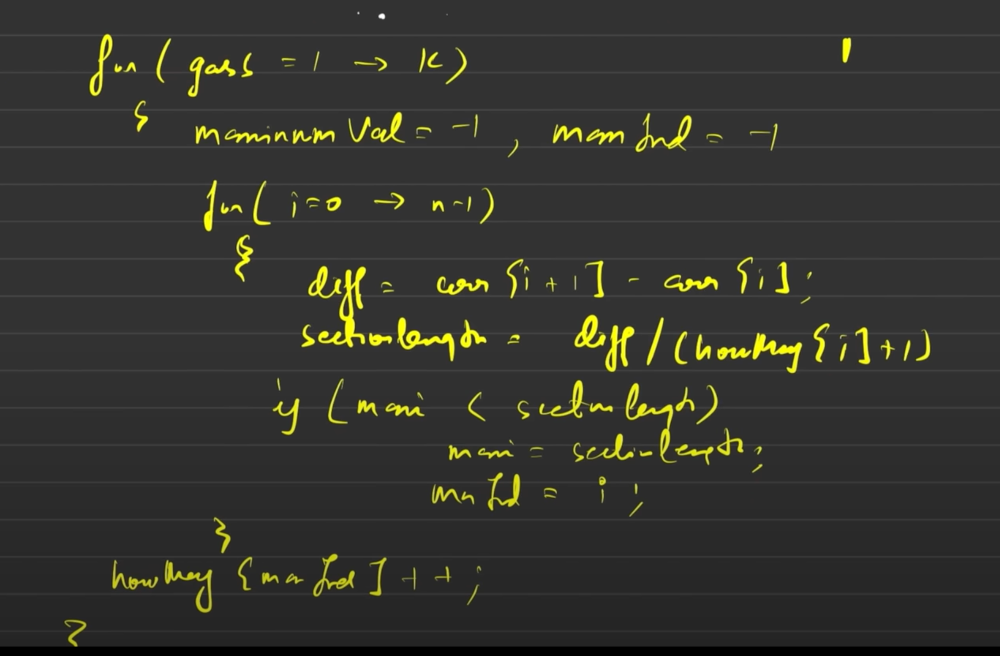
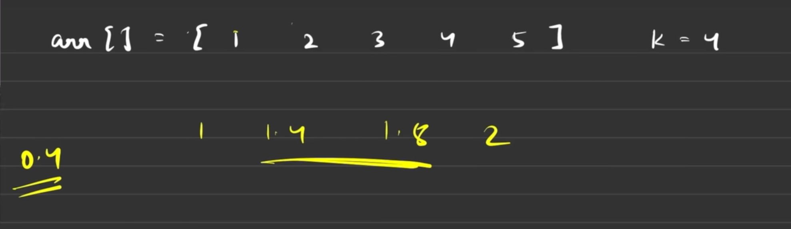
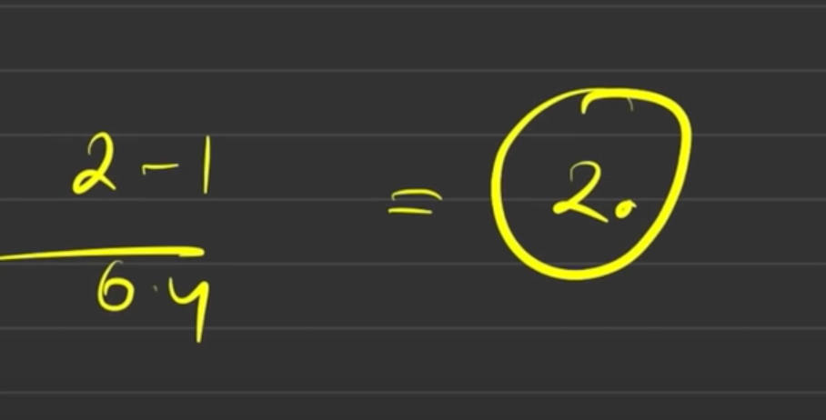
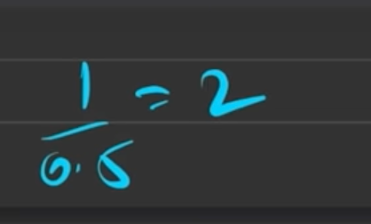
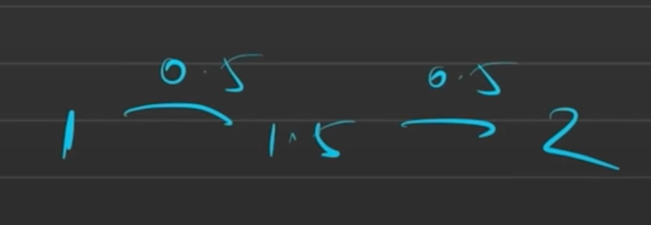

[Just a moment...](https://leetcode.com/problems/minimize-max-distance-to-gas-station/description/)

it doesnt make sense to place the gas station outside the range


You are doiing no good to the internal distances





# In the end


[BS-20. Minimise Maximum Distance between Gas Stations | 3 Approaches | Heap | Binary Search - YouTube](https://youtu.be/kMSBvlZ-_HA?si=5Wum-bST-q5BcfvW)

```cpp
double minmaxGasDist(vector<int>& v, int k) {
//minimise the maximum consecutive distance
    int n=v.size();
    vector<int> newStations(n-1,0);
    for(int newStation=1;newStation<=k;newStation++){
        long double maxSection=-1;
        int idx=-1;
        for(int i=1;i<n;i++){
            long double diff=v[i]-v[i-1];
            long double sectionLen=(long double)diff/(newStations[i-1]+1);
            if(sectionLen>maxSection){
                maxSection=sectionLen;
                idx=i-1;
            }
        }
        newStations[idx]++;
    }

    long double ans=-1;
    for(int i=1;i<n;i++){
        long double diff=v[i]-v[i-1];
        long double sectionLen=(long double)diff/(newStations[i-1]+1);
        ans=max(ans,sectionLen);
    }
    return ans;
}
```




wrong





```cpp
bool f(vector<int>& v, long double m,int k, int n){
    int cnt=0;
    for(int i=1;i<n;i++){
        int noInBetween=(int)(v[i]-v[i-1])/m;
        if((long double)(v[i]-v[i-1])==noInBetween*m) noInBetween--;
        cnt+=noInBetween;
    }
    return cnt<=k;
}

double minmaxGasDist(vector<int>& v, int k) {
//minimise the maximum consecutive distance
    int n=v.size();
    long double l=0,h=-1;
    for(int i=1;i<n;i++) h=max(h,(long double)v[i]-v[i-1]);
    long double ans=h;
    while(h-l>1e-6){
        long double m=(l+h)/2;
        if(f(v,m,k,n)){
            ans=m;
            h=m;
        }
        else l=m;
    }
    return ans;
}
```
