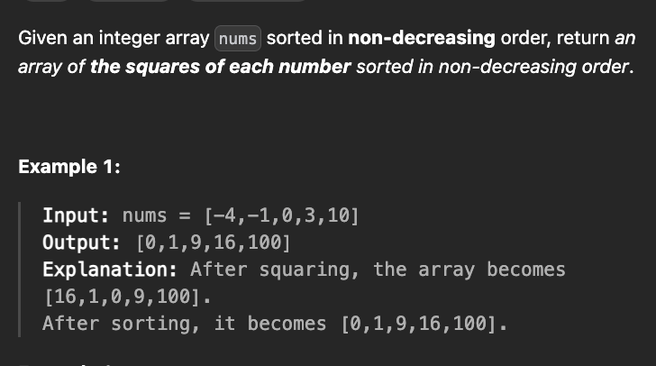

[Squares of a Sorted Array - LeetCode](https://leetcode.com/problems/squares-of-a-sorted-array/description/)




```cpp
vector<int> sortedSquares(vector<int>& v) {
    int p=0,n=v.size();
    while(p<n and v[p]<0) p++;
    int p1=p-1,p2=p;
    vector<int> ans;
    while(p1>=0 and p2<n){
        if(abs(v[p1])>abs(v[p2])) ans.push_back(v[p2++]);
        else ans.push_back(v[p1--]);
    }
    while(p1>=0) ans.push_back(v[p1--]);
    while(p2<n) ans.push_back(v[p2++]);
    for(int &x: ans) x=x*x;
    return ans;
}
```
[Sort the given array after applying the given equation | Practice | GeeksforGeeks ](https://www.geeksforgeeks.org/problems/sort-the-given-array-after-applying-the-given-equation0304/1)


```cpp
vector<long long> sortArray(vector<long long>arr, int n, long long A, long long B, long long C){
    for (int i = 0; i < n; i++) arr[i] = A*arr[i]*arr[i] + B*arr[i] + C; 
    
    int f = 1;
    if(A > 0) f = 2;
    
    int i = 0, j = n-1; 
    long long new_arr[n], k = 0; 
    
    //sorting the array according to the determined direction
    if(f==1){
        while (i <=j){
            if (arr[i] < arr[j])
                new_arr[k++] = arr[i++];
            else
                new_arr[k++] = arr[j--];
        }
    }else{
        while (i <=j){
            if (arr[i] > arr[j])
                new_arr[k++] = arr[i++];
            else
                new_arr[k++] = arr[j--];
        }
    } 
    
    //copying the sorted array back to the original array
    for(int i = 0; i < n; i++)
        arr[i] = new_arr[i];

    //reversing the array if the sorting direction is reversed
    if(f == 2){
        for(int i = 0; i < n / 2; i++)
            swap(arr[i], arr[n - i - 1]);
    }

    //returning the sorted array
    return arr;
}
```