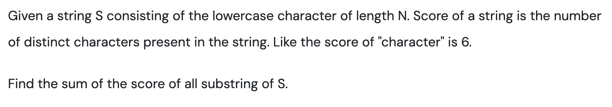
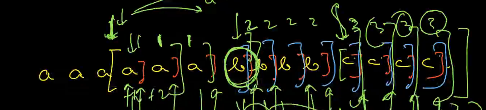
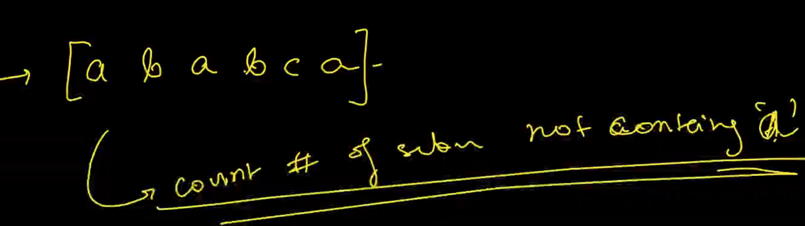
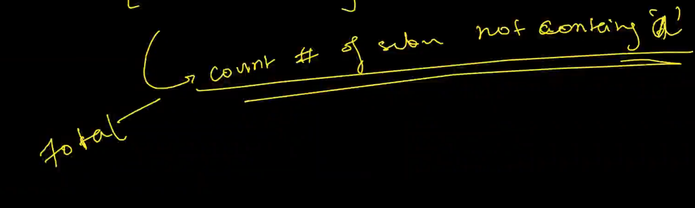
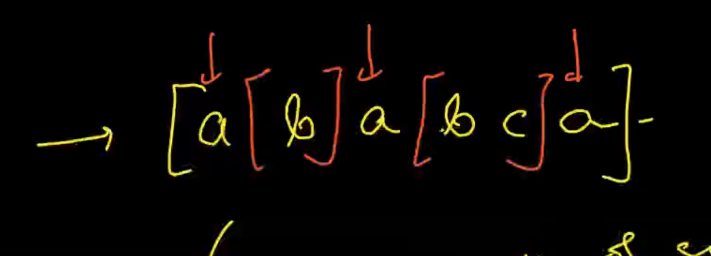
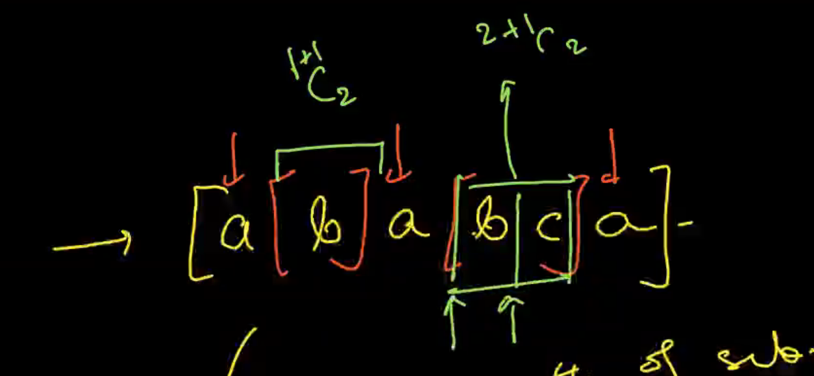
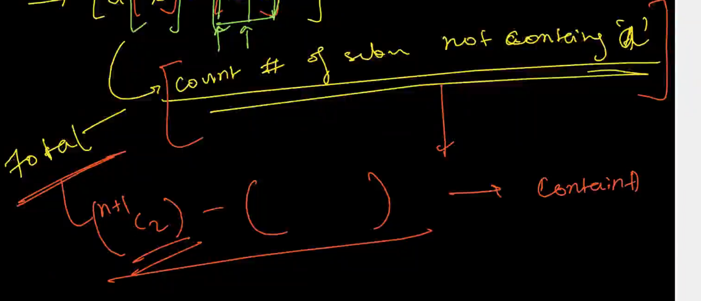

[maang.in](https://maang.in/problems/Count-Distinct-Char-in-Substrings-62?resourceUrl=cs99-cp512-pl3478-rs62)



# Idea 1


# Idea 2






```cpp
void solve(){
    iinp(n);
    sinp(s);
    vl prev(26,-1);
    ll ans=13*n*(n+1);
    for(ll i=0;i<n;i++){
        char c=s[i];
        ll rods=i-prev[c-'a'];
        ans-=(rods*(rods-1))/2;
        prev[c-'a']=i;        
    }
    for(ll i=0;i<26;i++){
        ll rods=n-prev[i];
        ans-=(rods*(rods-1))/2;
    }
    cout<<ans<<endl;
}
```
