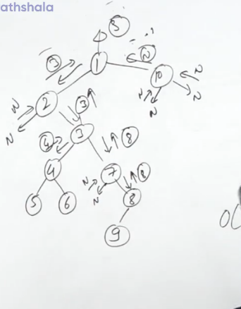

[Root to Leaf Paths | Practice | GeeksforGeeks ](https://practice.geeksforgeeks.org/problems/root-to-leaf-paths/1)
```cpp
void f(vector<vector<int>> &ans, vector<int> &tmp, Node* node){
    if(!node) return;
    tmp.push_back(node->data);
    if(!node->left and !node->right){
        ans.push_back(tmp);
        tmp.pop_back();
        return;
    }
    f(ans,tmp,node->left);
    f(ans,tmp,node->right);
    tmp.pop_back();
}
 
 
vector<vector<int>> Paths(Node* root){
    vector<vector<int>> ans;
    vector<int> tmp;
    f(ans,tmp,root);
    return ans;
}
```
--------------------------------------------------------------------------------------------------------------------------------------------------------


LCA of 3 and 7 will be 3 and 3 will be returned before 7 is touched, same would have happened if 3 and 70 when 70 is not present

1. If the node is not present

```cpp
    TreeNode* f(TreeNode* n, TreeNode* r1, TreeNode* r2){
        if(!n) return NULL;
        if(n==r1 or n==r2) return n;
        TreeNode* lst=lowestCommonAncestor(n->left,r1,r2);
        TreeNode* rst=lowestCommonAncestor(n->right,r1,r2);
        if(!lst) return rst;
        if(!rst) return lst;
        return n; 
    }


    TreeNode* lowestCommonAncestor(TreeNode* n, TreeNode* r1, TreeNode* r2) {
        TreeNode* lca=f(n,r1,r2);
        if(lca==r1 or lca==r2){
            //check whether the other node if present or not 
            if(lca==r1)
            //check for r2 in tree 
            ;
            if(lca==r2)
            //check for r1 in tree 
            ;            
        }
        return lca;
    }
```
