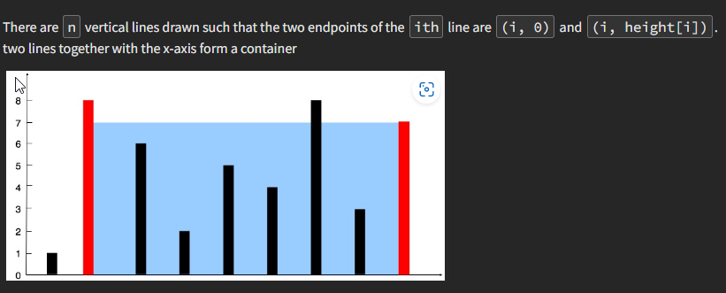

[Container With Most Water - LeetCode](https://leetcode.com/problems/container-with-most-water/description/)


1. Find that container having the most water



# Two pointers
```
int maxArea(vector<int>& v) {
   int n=v.size();
   int l=0,h=n-1;
   int ans=INT_MIN;
   while(l<h){
       int minn=min(v[l],v[h]);
       ans=max(ans,(h-l)*minn);
       if(v[l]==minn) l++;
       else h--;
   } 
   return ans;
}
```

