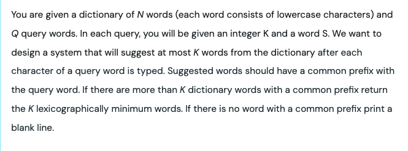
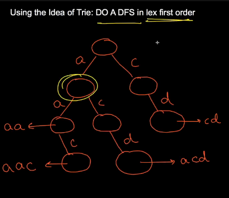
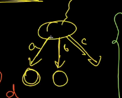
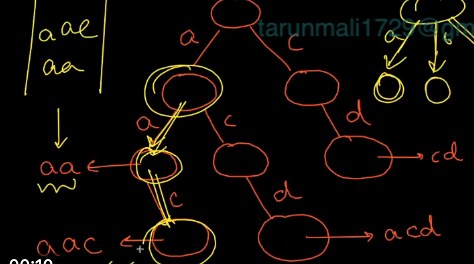
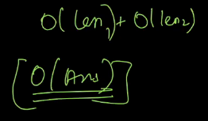

[maang.in](https://maang.in/problems/Auto-Suggestion-426?resourceUrl=cs84-cp498-pl3346-rs426)







Suppose common prefix till this node as in the query

after that lexigraphically we will do dfs




```cpp
class Trie{
    private:
        struct TrieNode{
            TrieNode* children[26];
            int noOfTimesPresent;
            int strings; 
            multiset<string> words;

            TrieNode(){
                noOfTimesPresent = 0;
                strings = 0;
                for(int i = 0; i < 26; i++) {
                    children[i] = nullptr;
                }
            }
        };

        TrieNode* root=nullptr;

    public:

    Trie(){
        root = new TrieNode();
    }

    ~Trie() {
        delete root;
    }
/*******************************************************************************************/

    void insertUtil(TrieNode* node, string &word, int idx){
        node->strings++;
        node->words.insert(word);
        if(idx==word.size()){
            node->noOfTimesPresent++;
            return;
        }
        int childIdx=word[idx]-'a';
        if(!node->children[childIdx]){
            node->children[childIdx]= new TrieNode();;
        }
        node=node->children[childIdx];        
        insertUtil(node,word,idx+1);   
    }

    void insert(string &word){
        insertUtil(root,word,0);
    }

/*******************************************************************************************/

    int searchUtil(string &word, int idx, TrieNode* node){
        if(!node) return 0;
        if(idx==word.size()) return node->noOfTimesPresent;
        return searchUtil(word,idx+1,node->children[word[idx]-'a']);
    }

    int search(string word) {
        return searchUtil(word,0,root);
    }

/*******************************************************************************************/


    int startsWithUtil(string &prefix, int idx, TrieNode* node){
        if(!node) return 0;
        if(idx==prefix.size()) return node->strings;
        return startsWithUtil(prefix,idx+1,node->children[prefix[idx]-'a']);
    }

    int startsWith(string prefix) {
        return startsWithUtil(prefix,0,root);
    }


/*******************************************************************************************/

    void eraseUtil(string &word, int idx, TrieNode* node){
        node->strings--;
        if(idx==word.size()){
            node->noOfTimesPresent--;
            return;
        }
        eraseUtil(word,idx+1,node->children[word[idx]-'a']);
    }


    void erase(string &word){
        if(search(word)){
            eraseUtil(word,0,root);
        }
    }

/*******************************************************************************************/
    void dfs(TrieNode* curr, string &word, vector<string> &ans, ll k){
        if (ans.size() >= k) return;
        if (curr->noOfTimesPresent > 0) {
            ans.push_back(word);
        }
        for (int j = 0; j < 26; j++) {
            if (curr->children[j]) {
                word.push_back('a' + j);
                dfs(curr->children[j], word,ans,k);
                word.pop_back();
            }
        }
    }
    
    void solve(ll n, string &s, ll k){
        TrieNode* curr=root;
        string prefix = "";
        for(int i=0;i<n;i++){
            vector<string> ans;
            /********CORE LOGIC*********/
            char c=s[i];
            prefix.push_back(c);
            ll idx= c-'a';
            if(!curr->children[idx]){
                while(i<n){
                    cout<<endl;
                    i++;
                }
                break;
            }
            curr=curr->children[idx];
            // dfs(curr,prefix,ans,k);
            for (string word : curr->words) {
                ans.push_back(word);
            }
            /*************************/
            for(ll i=0;i<min(k,(ll)ans.size());i++){
                cout<<ans[i]<<" ";
            }
            cout<<endl;
        }
    }
};


void solve(){
    Trie t=Trie();
    ll N,maxLen,q;
    cin>>N>>maxLen>>q;
    while(N--){
        iinp(tmp);   
        sinp(s);
        t.insert(s);
    }
    while(q--){
        iinp(n);
        sinp(s);
        iinp(k);
        t.solve(n,s,k);
    }
}

```
