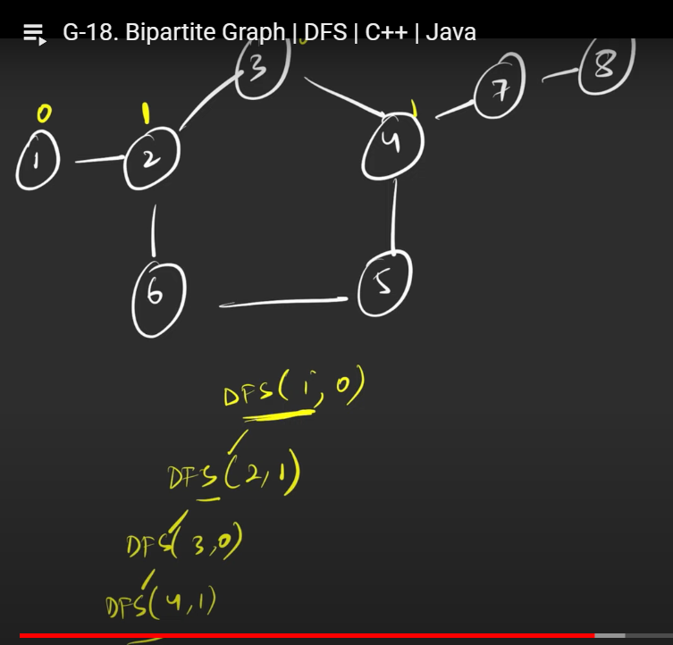

1. two sets v1 and v2
2. odd length cycle graph never bipartite
3. Linear graph is always bipartite


[Is Graph Bipartite? - LeetCode](https://leetcode.com/problems/is-graph-bipartite/description/)

# Striver way
```cpp
bool dfs(int node,int col, vector<int> &color, vector<vector<int>>& al){
    color[node]=col;
    for(int nei: al[node]){
        if(color[nei]==-1){
            if(dfs(nei,!col,color,al)==0) return 0;
        }
        else if(color[nei]==col) return 0;
    }
    return 1;
}


bool isBipartite(vector<vector<int>>& al) {
    int n=al.size();
    vector<int> color(n,-1);
    for(int i=0;i<n;i++){
        if(color[i]==-1){
            if(dfs(i,0,color,al)==0) return 0;
        }
    }
    return 1;
}
```


# PPa way
```cpp
```