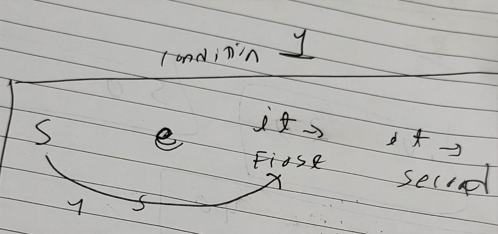

[My Calendar I - LeetCode](https://leetcode.com/problems/my-calendar-i/)




```CPP
class MyCalendar {
set<pair<int,int>>se;
public:
    MyCalendar() {
        
    }
    
    bool book(int s, int e) {
        auto it = se.upper_bound({s,INT_MIN});
        if(it!=se.end()){
          //it->first s se zyada to by definition heen hoga
          //par jaruri nahi ue quantittu it wali e se zyada hon
            if(it->first<e) return 0;
        }
        if(it!=se.begin()){
            auto it1 = it;
            it1--;
            if(it1->second>s) return 0;
        }
        se.insert({s,e});
        return 1;
    }
};

```