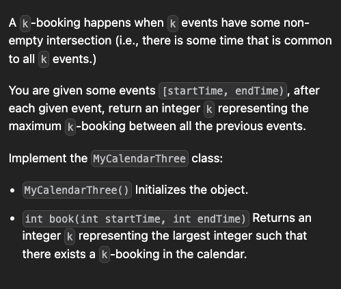
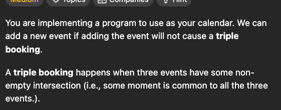

Do related grokking conceots


# Easy O(n) solution of finding the number of intersections
# 3

```cpp
class MyCalendarThree {
    map<int,int> m;
public:
    MyCalendarThree() {
        
    }
    
    int book(int s, int e){
        int maxx=0;
        m[s]++;
        m[e]--;

        int sum=0;
        for(auto p: m){
            sum+=p.second;
            maxx=max(maxx,sum);
        }
        return maxx;
    }
};
```

# 2

```cpp
class MyCalendarTwo {
        map<int,int> m;
public:
    MyCalendarTwo() {
        
    }
    
    bool book(int s, int e) {
        int maxx=0;
        m[s]++;
        m[e]--;

        int sum=0;
        for(auto p: m){
            sum+=p.second;
            maxx=max(maxx,sum);
            if(maxx>=3){
                m[s]--;
                m[e]++;
                return 0;
            } 
        }
        return 1;
    }
};

```
# 1


```cpp
class MyCalendar {
    map<int,int> m;
public:
    MyCalendar() {
        
    }
    
    bool book(int s, int e) {
        int maxx=0;
        m[s]++;
        m[e]--;

        int sum=0;
        for(auto p: m){
            sum+=p.second;
            maxx=max(maxx,sum);
            if(maxx>1){
                m[s]--;
                m[e]++;
                return 0;
            } 
        }
        return 1;
    }
};

```
