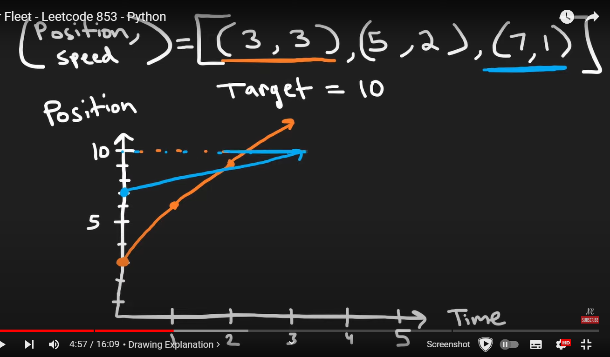
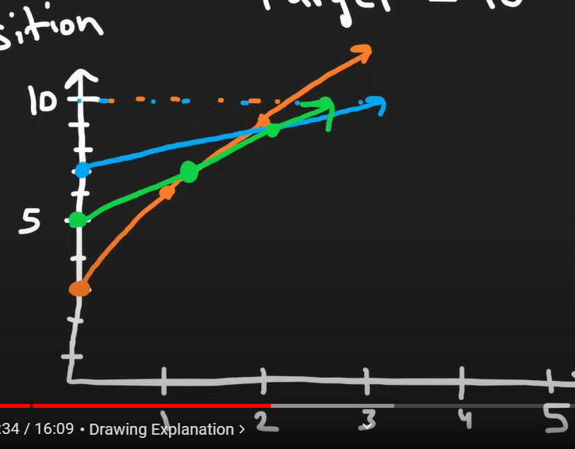
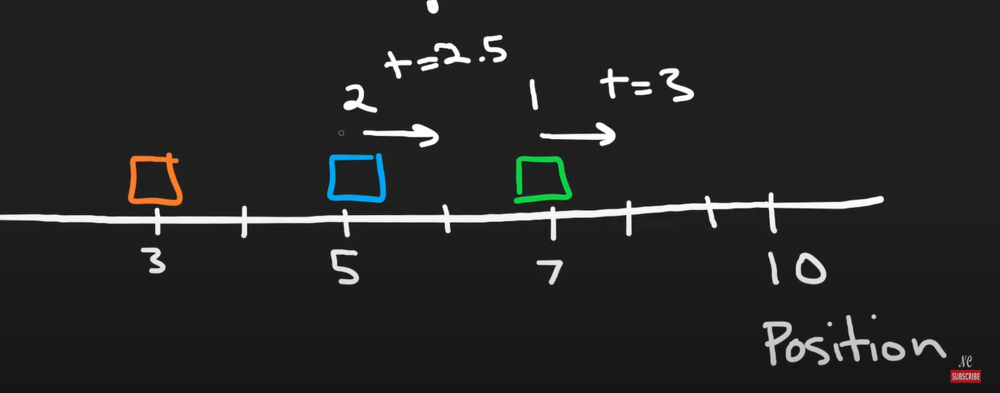

[Car Fleet - LeetCode](https://leetcode.com/problems/car-fleet/description/)




After intersection their speed will be equal to the speed of the lower car






[Car Fleet - Leetcode 853 - Python - YouTube](https://youtu.be/Pr6T-3yB9RM?si=p0tUApZDau0_rrmS)


```cpp
int carFleet(int k, vector<int>& p, vector<int>& s) {
    int n = p.size();
    
    vector<pair<int, double>> v;
    for (int i = 0; i < n; i++) {
        double time = (double) (k- p[i]) / s[i];
        v.push_back({p[i], time});
    }
    sort(v.begin(), v.end());
    
    stack<double> times;
    
    for (int i = n - 1; i >= 0; i--) {
        double time = v[i].second;
        if (times.empty() || time > times.top()) {
            times.push(time);
        }
    }
    return times.size();
    
}
```