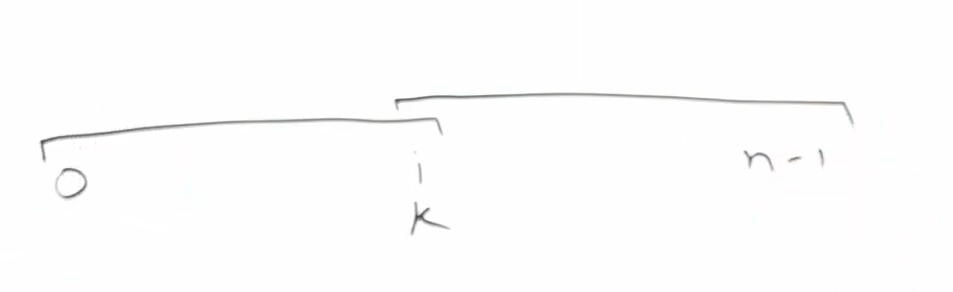
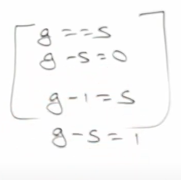
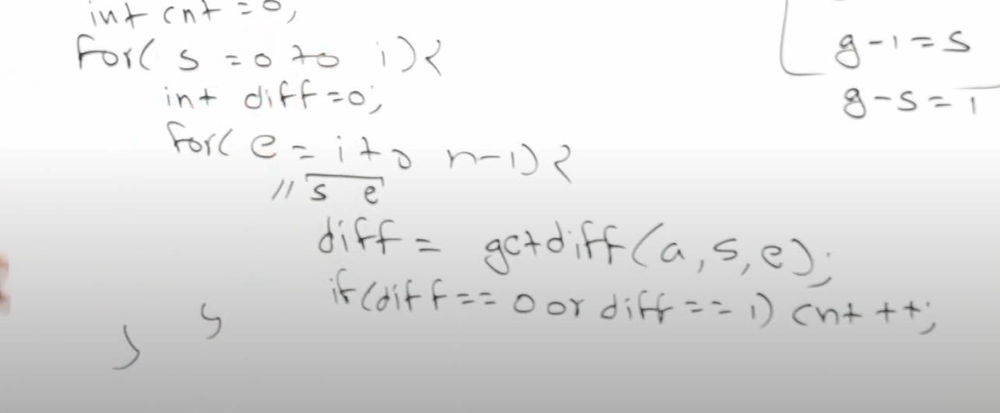
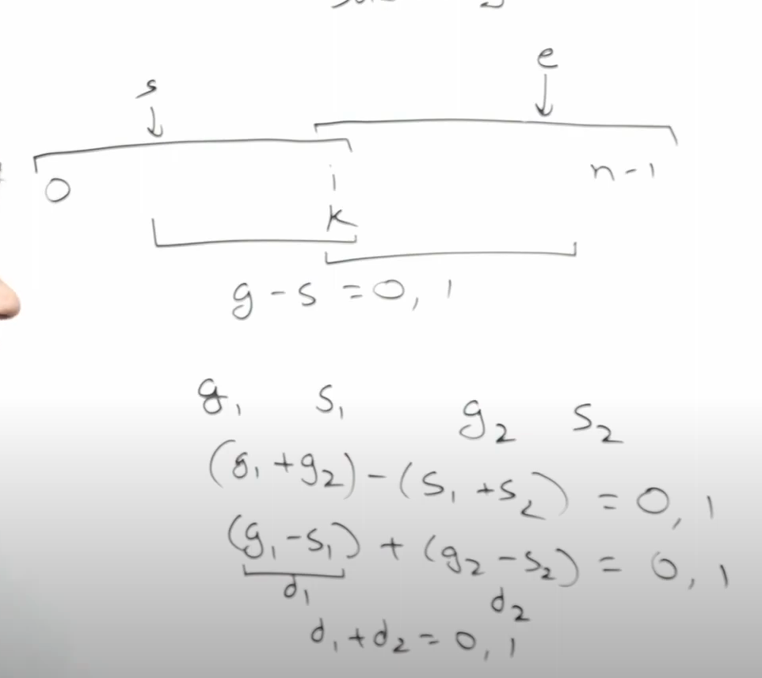
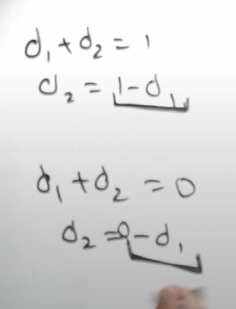
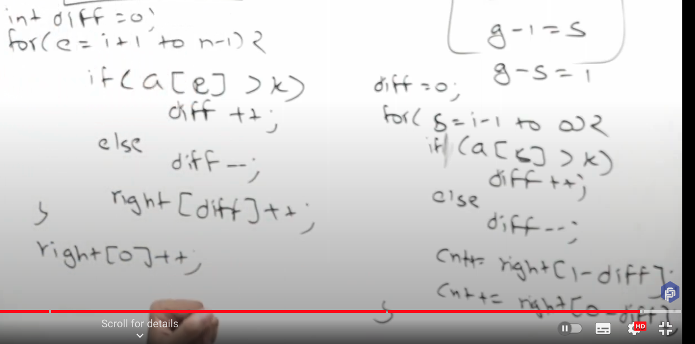

[Count Subarrays With Median K - LeetCode](https://leetcode.com/problems/count-subarrays-with-median-k/)


1. All subarrays
2. Subarrays containing k

3. K is the median of that subarray 




--------
 
 
 
 


   




```cpp
int n=v.size();
int idx=-1;
for(int i=0;i<n;i++){
    if(v[i]==k){
        idx=i;
        break;
    }
}
if(idx==-1) return 0;
int diff=0;
unordered_map<int,int> right;
for(int e=idx;e<n;e++){
    if(v[e]>k){
        diff++;
    }
    else if(v[e]<k){
        diff--;
    }
    right[diff]++;
}
diff=0;
int ans=0;
for(int s=idx;s>=0;s--){
    if(v[s]>k){
        diff++;
    }
    else if(v[s]<k){
        diff--;
    }
    ans+=right[1-diff];
    ans+=right[-diff];
// 
return ans;
}
```