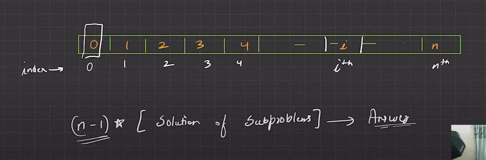
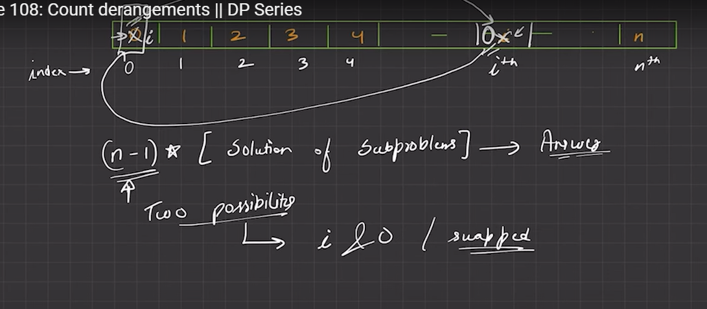
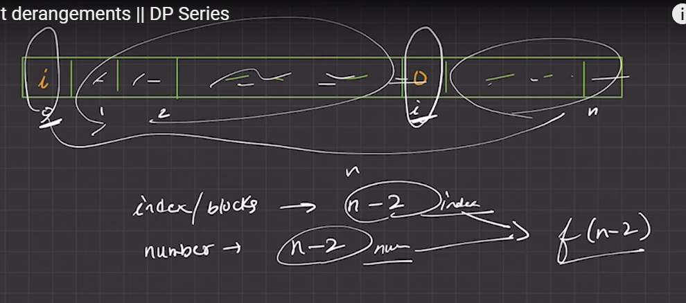
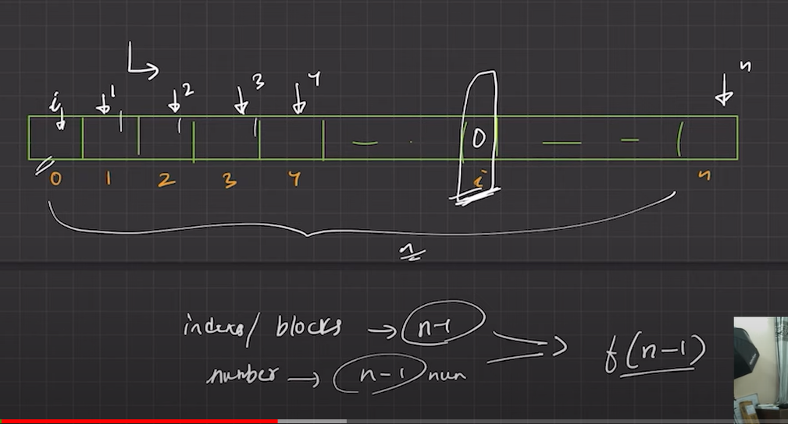
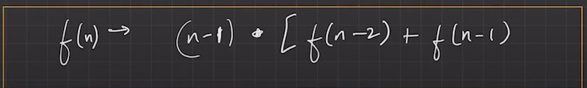

[Coding Ninjas Studio](https://www.codingninjas.com/studio/problems/count-derangements_873861?leftPanelTabValue=PROBLEM)

[Lecture 108: Count derangements  || DP Series - YouTube](https://youtu.be/NW-BLDQHFXk?si=ELZLowt0JVSwsDe7)











```cpp
long long int countDerangements(int n) {
    if(n==1) return 0;
    if(n==2) return 1;
    return (n-1)*(countDerangements(n-1)+countDerangements(n-2));
}
```

```cpp

ll f(ll n, vector<ll> &mem) {
    if(n==1) return 0;
    if(n==2) return 1;
    if(mem[n]!=-1) return mem[n];
    return mem[n]=modm((n-1),moda(f(n-1,mem),f(n-2,mem)));
}

long long int countDerangements(int n) {
    vector<ll> mem(n+1,-1);
    return f(n,mem);
}
```


```cpp
long long int countDerangements(int n) {
    vector<int> dp(n+1);
    dp[1]=0;
    dp[2]=1;
    for(int i=3;i<=n;i++){
        dp[i]=modm((i-1),moda(dp[i-1],dp[i-2]));
    }

    return dp[n];
}
```

# Space optimized

```cpp
long long int countDerangements(int n) {
    if(n==1) return 0;
    if(n==2) return 1;
    int ans;
    int prev1=0;
    int prev2=1;
    for(int i=3;i<=n;i++){
        ans=modm((i-1),moda(prev2,prev1));
        prev1=prev2;
        prev2=ans;
    }

    return ans;
}
```
