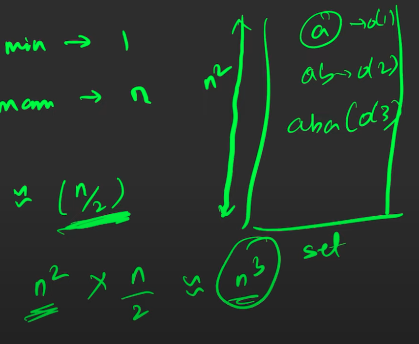
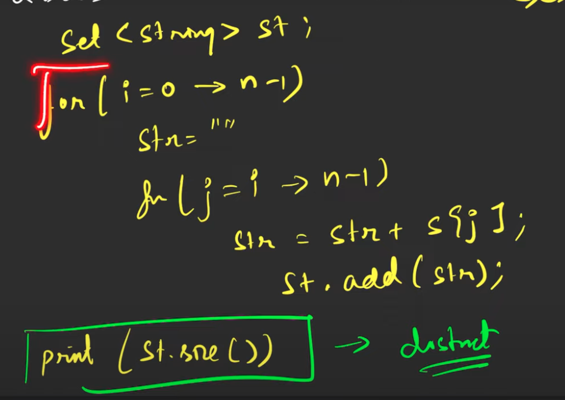
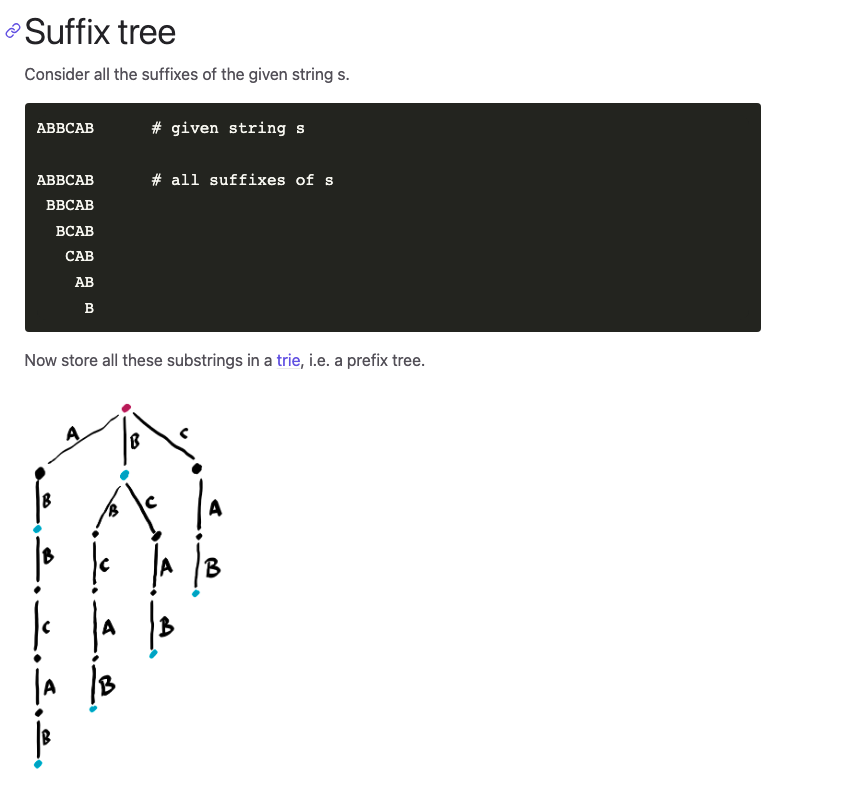
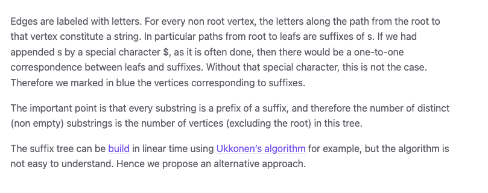

cleverly in n^2 logn  
logn nahi hoga
log n^3

SC is n^3



 




if n^2 unique substrings 
# By string algorithms


# By tries
[Count all distinct substrings - TryAlgo](https://tryalgo.org/en/strings/2021/02/15/count-distinct-substrings/)

# Space complexity is decreased
less then n^3?

# Best and simple
*************************

```cpp
    int countDistinctSubstrings(string &s, int n){
    /**********************CUSTOM INSERT FOR SUBSTRINGS*****************/
        for(int i=0;i<n;i++){
            TrieNode* curr=root;
            int cnt=0;
            for(int j=i;j<n;j++){
                char c=s[j];
                int idx=c-'a';
                if(!curr->children[idx]){
                    curr->children[idx]= new TrieNode();
                    noOfNodes++;
                }
                curr=curr->children[idx];
    /******************************************************************/
            }
        }
        return noOfNodes;
    }

};


int countDistinctSubstrings(string &s){
    Trie t= Trie();
    int n=s.size();
    return t.countDistinctSubstrings(s,n);
}
```


```cpp
class Trie{
    private:
        struct TrieNode{
            TrieNode* children[26];
            int noOfTimesPresent;
            int strings;

            TrieNode(){
                noOfTimesPresent = 0;
                strings = 0;
                for(int i = 0; i < 26; i++) {
                    children[i] = nullptr;
                }
            }
        };

    TrieNode* root=nullptr;
    public:
        int noOfNodes; 

    Trie(){
        root = new TrieNode();
        noOfNodes=1;
    }

    ~Trie() {
        delete root;
    }
/*******************************************************************************************/

    void insertUtil(TrieNode* node, string &word, int idx){
        node->strings++;
        if(idx==word.size()){
            node->noOfTimesPresent++;
            return;
        }
        int childIdx=word[idx]-'a';
        if(!node->children[childIdx]){
            node->children[childIdx]= new TrieNode();
            noOfNodes++;
        }
        node=node->children[childIdx];        
        insertUtil(node,word,idx+1);   
    }

    void insert(string word){
        insertUtil(root,word,0);
    }

/*******************************************************************************************/

    int searchUtil(string &word, int idx, TrieNode* node){
        if(!node) return 0;
        if(idx==word.size()) return node->noOfTimesPresent;
        return searchUtil(word,idx+1,node->children[word[idx]-'a']);
    }

    int search(string word) {
        return searchUtil(word,0,root);
    }

/*******************************************************************************************/


    int startsWithUtil(string &prefix, int idx, TrieNode* node){
        if(!node) return 0;
        if(idx==prefix.size()) return node->strings;
        return startsWithUtil(prefix,idx+1,node->children[prefix[idx]-'a']);
    }

    int startsWith(string prefix) {
        return startsWithUtil(prefix,0,root);
    }


/*******************************************************************************************/

    void eraseUtil(string &word, int idx, TrieNode* node){
        node->strings--;
        if(idx==word.size()){
            node->noOfTimesPresent--;
            return;
        }
        eraseUtil(word,idx+1,node->children[word[idx]-'a']);
    }


    void erase(string &word){
        if(search(word)){
            eraseUtil(word,0,root);
        }
    }

/*******************************************************************************************/
    int countDistinctSubstrings(string &s, int n){
    /**********************CUSTOM INSERT FOR SUBSTRINGS*****************/
        for(int i=0;i<n;i++){
            TrieNode* curr=root;
            int cnt=0;
            for(int j=i;j<n;j++){
                char c=s[j];
                int idx=c-'a';
                if(!curr->children[idx]){
                    curr->children[idx]= new TrieNode();
                    noOfNodes++;
                }
                curr=curr->children[idx];
    /******************************************************************/
            }
        }
        return noOfNodes;
    }

};


int countDistinctSubstrings(string &s){
    Trie t= Trie();
    int n=s.size();
    return t.countDistinctSubstrings(s,n);
}
```


****************


**************************
# Simple approach
**********************************

```cpp
class Trie{
    private:
        struct TrieNode{
            TrieNode* children[26];
            int noOfTimesPresent;
            int strings;

            TrieNode(){
                noOfTimesPresent = 0;
                strings = 0;
                for(int i = 0; i < 26; i++) {
                    children[i] = nullptr;
                }
            }
        };

    TrieNode* root=nullptr;
    public:
        int noOfNodes; 

    Trie(){
        root = new TrieNode();
        noOfNodes=1;
    }

    ~Trie() {
        delete root;
    }
/*******************************************************************************************/

    void insertUtil(TrieNode* node, string &word, int idx){
        node->strings++;
        if(idx==word.size()){
            node->noOfTimesPresent++;
            return;
        }
        int childIdx=word[idx]-'a';
        if(!node->children[childIdx]){
            node->children[childIdx]= new TrieNode();
            noOfNodes++;
        }
        node=node->children[childIdx];        
        insertUtil(node,word,idx+1);   
    }

    void insert(string word){
        insertUtil(root,word,0);
    }

/*******************************************************************************************/

    int searchUtil(string &word, int idx, TrieNode* node){
        if(!node) return 0;
        if(idx==word.size()) return node->noOfTimesPresent;
        return searchUtil(word,idx+1,node->children[word[idx]-'a']);
    }

    int search(string word) {
        return searchUtil(word,0,root);
    }

/*******************************************************************************************/


    int startsWithUtil(string &prefix, int idx, TrieNode* node){
        if(!node) return 0;
        if(idx==prefix.size()) return node->strings;
        return startsWithUtil(prefix,idx+1,node->children[prefix[idx]-'a']);
    }

    int startsWith(string prefix) {
        return startsWithUtil(prefix,0,root);
    }


/*******************************************************************************************/

    void eraseUtil(string &word, int idx, TrieNode* node){
        node->strings--;
        if(idx==word.size()){
            node->noOfTimesPresent--;
            return;
        }
        eraseUtil(word,idx+1,node->children[word[idx]-'a']);
    }


    void erase(string &word){
        if(search(word)){
            eraseUtil(word,0,root);
        }
    }

/*******************************************************************************************/

};


int countDistinctSubstrings(string &s){
    Trie t= Trie();
    int n=s.size();
    for(int i=0;i<n;i++){
        string substring="";
        for(int j=i;j<n;j++){
            substring.push_back(s[j]);
            t.insert(substring);
        }
    }
    return t.noOfNodes;
}
```


*********************************






*****************************
# Complex approach
*********************************************************
```cpp
class Trie{
    private:
        struct TrieNode{
            TrieNode* children[26];
            int noOfTimesPresent;
            int strings;

            TrieNode(){
                noOfTimesPresent = 0;
                strings = 0;
                for(int i = 0; i < 26; i++) {
                    children[i] = nullptr;
                }
            }
        };

    TrieNode* root=nullptr;
    public:
        int noOfNodes; 

    Trie(){
        root = new TrieNode();
        noOfNodes=1;
    }

    ~Trie() {
        delete root;
    }
/*******************************************************************************************/

    void insertUtil(TrieNode* node, string &word, int idx){
        node->strings++;
        if(idx==word.size()){
            node->noOfTimesPresent++;
            return;
        }
        int childIdx=word[idx]-'a';
        if(!node->children[childIdx]){
            node->children[childIdx]= new TrieNode();
            noOfNodes++;
        }
        node=node->children[childIdx];        
        insertUtil(node,word,idx+1);   
    }

    void insert(string word){
        insertUtil(root,word,0);
    }

/*******************************************************************************************/

    int searchUtil(string &word, int idx, TrieNode* node){
        if(!node) return 0;
        if(idx==word.size()) return node->noOfTimesPresent;
        return searchUtil(word,idx+1,node->children[word[idx]-'a']);
    }

    int search(string word) {
        return searchUtil(word,0,root);
    }

/*******************************************************************************************/


    int startsWithUtil(string &prefix, int idx, TrieNode* node){
        if(!node) return 0;
        if(idx==prefix.size()) return node->strings;
        return startsWithUtil(prefix,idx+1,node->children[prefix[idx]-'a']);
    }

    int startsWith(string prefix) {
        return startsWithUtil(prefix,0,root);
    }


/*******************************************************************************************/

    void eraseUtil(string &word, int idx, TrieNode* node){
        node->strings--;
        if(idx==word.size()){
            node->noOfTimesPresent--;
            return;
        }
        eraseUtil(word,idx+1,node->children[word[idx]-'a']);
    }


    void erase(string &word){
        if(search(word)){
            eraseUtil(word,0,root);
        }
    }

/*******************************************************************************************/

};


int countDistinctSubstrings(string &s){
    Trie t= Trie();
    int n=s.size();
    for(int i=0;i<n;i++){
        t.insert(s.substr(i));
    }
    return t.noOfNodes;

}
```


***********************************************************

```cpp
    int countNodesUtil(TrieNode* node){
        if(!node) return 0;
        int subTreeNodes = 1;

        for (int i = 0; i < 26; i++){
            subTreeNodes += countNodesUtil(node->children[i]);
        }

        return subTreeNodes;
    }
    
    int countNodes(){
        return countNodesUtil(root);
    }
```

```cpp
class Trie{
    private:
        struct TrieNode{
            TrieNode* children[26];
            int noOfTimesPresent;
            int strings; 

            TrieNode(){
                noOfTimesPresent = 0;
                strings = 0;
                for(int i = 0; i < 26; i++) {
                    children[i] = nullptr;
                }
            }
        };

        TrieNode* root=nullptr;

    public:

    Trie(){
        root = new TrieNode();
    }

    ~Trie() {
        delete root;
    }
/*******************************************************************************************/

    void insertUtil(TrieNode* node, string &word, int idx){
        node->strings++;
        if(idx==word.size()){
            node->noOfTimesPresent++;
            return;
        }
        int childIdx=word[idx]-'a';
        if(!node->children[childIdx]){
            node->children[childIdx]= new TrieNode();;
        }
        node=node->children[childIdx];        
        insertUtil(node,word,idx+1);   
    }

    void insert(string word){
        insertUtil(root,word,0);
    }

/*******************************************************************************************/

    int searchUtil(string &word, int idx, TrieNode* node){
        if(!node) return 0;
        if(idx==word.size()) return node->noOfTimesPresent;
        return searchUtil(word,idx+1,node->children[word[idx]-'a']);
    }

    int search(string word) {
        return searchUtil(word,0,root);
    }

/*******************************************************************************************/


    int startsWithUtil(string &prefix, int idx, TrieNode* node){
        if(!node) return 0;
        if(idx==prefix.size()) return node->strings;
        return startsWithUtil(prefix,idx+1,node->children[prefix[idx]-'a']);
    }

    int startsWith(string prefix) {
        return startsWithUtil(prefix,0,root);
    }


/*******************************************************************************************/

    void eraseUtil(string &word, int idx, TrieNode* node){
        node->strings--;
        if(idx==word.size()){
            node->noOfTimesPresent--;
            return;
        }
        eraseUtil(word,idx+1,node->children[word[idx]-'a']);
    }


    void erase(string &word){
        if(search(word)){
            eraseUtil(word,0,root);
        }
    }

/*******************************************************************************************/
    int countNodesUtil(TrieNode* node){
        if(!node) return 0;
        int subTreeNodes = 1;

        for (int i = 0; i < 26; i++){
            subTreeNodes += countNodesUtil(node->children[i]);
        }

        return subTreeNodes;
    }
    
    int countNodes(){
        return countNodesUtil(root);
    }

};


int countDistinctSubstrings(string &s){
    Trie t= Trie();
    int n=s.size();
    for(int i=0;i<n;i++){
        t.insert(s.substr(i));
    }
    return t.countNodes();

}
```

