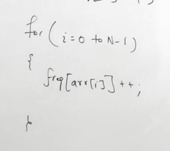
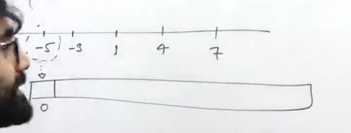
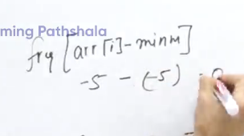
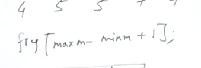
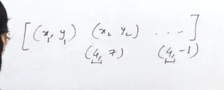
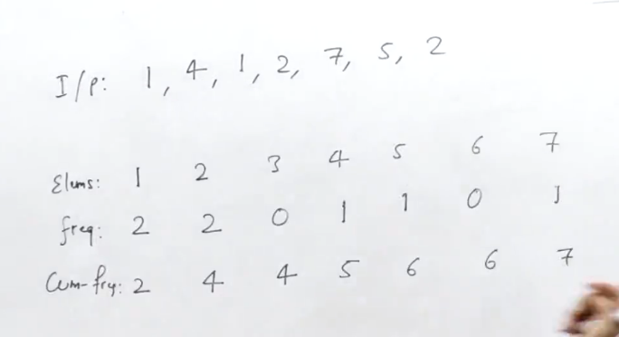
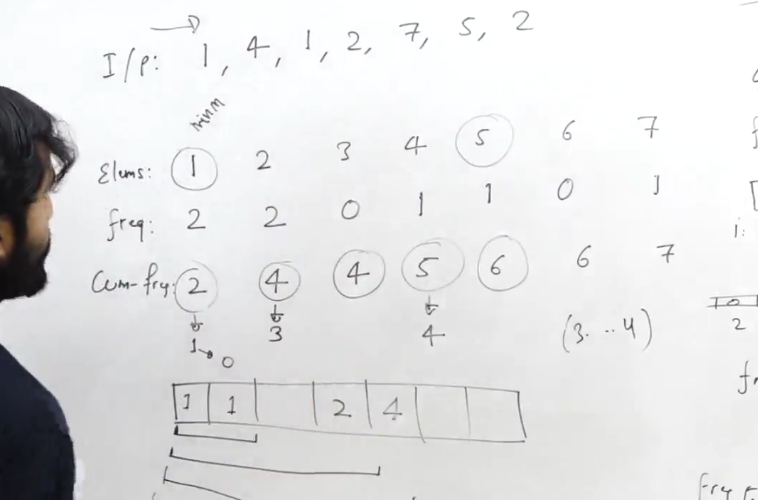
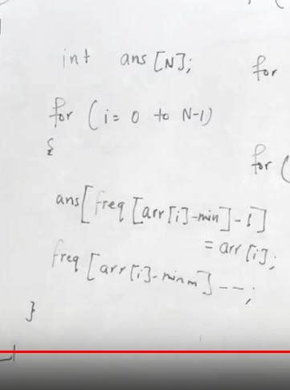

[Sort an Array - LeetCode](https://leetcode.com/problems/sort-an-array/description/)
```cpp
vector<int> sortArray(vector<int>& v) {
    int n=v.size();
    vector<int> ans(n);
    int maxx=*max_element(v.begin(),v.end()),minn=*min_element(v.begin(),v.end());
    int range=maxx-minn+1;
    vector<int> freq(range,0);
    for(int x: v){
        freq[x-minn]++;
    }
    for(int i=1;i<range;i++){
        freq[i]+=freq[i-1];
    }

    //do it reverse to make it stable
    for(int x: v){
        ans[freq[x-minn]-1]=x;
        freq[x-minn]--;
    }
    return ans;
}
```


# Step by step

Frequency based sorting
TC: O(max_element)


If elements till 10^5



# Problem of negative numbers



1. this can be used to optimize our space for positive elemets only




# Shortcomes
1. Sorting pair of integers


once you cnt 4 frequencies together how you will distinguish between the two pairs

# Next approach TC: O(maxx-minn) or O(n)





# Not maintinaing stability, infact highly unstable

# Start from end of the input array to make it stable