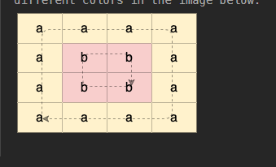

[Detect Cycles in 2D Grid - LeetCode](https://leetcode.com/problems/detect-cycles-in-2d-grid/description/)



1. the minimum length of cycle will be always 4

```cpp
bool isValid(ll r, ll c , ll rr, ll cc){
    return r>=0 and r<rr and c>=0 and c<cc;	
}

bool dfs(int pr, int pc, int r, int c, vector<vector<bool>> &vis, vector<vector<char>>& ma, vector<vector<int>> &dir, char &curr, int rr, int cc){
    vis[r][c]=1;
    for(auto v:dir){
        int tr=r+v[0],tc=c+v[1];
        if(!isValid(tr,tc,rr,cc) or (pr==tr and pc==tc) or ma[tr][tc]!=curr) continue;
        if(vis[tr][tc]) return 1;
        if(dfs(r,c,tr,tc,vis,ma,dir,curr,rr,cc)) return 1;
    }
    return 0;
}

bool containsCycle(vector<vector<char>>& ma) {
    vector<vector<int>> dir={{1,0},{-1,0},{0,1},{0,-1}};
    int rr=ma.size(),cc=ma[0].size();
    vector<vector<bool>> vis(rr,vector<bool>(cc,0));
    for(int r=0;r<rr;r++){
        for(int c=0;c<cc;c++){
            if(!vis[r][c] and dfs(-1,-1,r,c,vis,ma,dir,ma[r][c],rr,cc)) return 1;
        }
    }
    return 0;
}
```



if (a) ...

if (b)....

else if (c)   // this will get paired with the if(b) 

  

if (a){if(b)....}

else if (c)    // this will now get paired with if(a) and this is what you wanted . That is why you should  put bracket before if(b) for correct answer.



```cpp
bool isValid(ll r, ll c , ll rr, ll cc){
    return r>=0 and r<rr and c>=0 and c<cc;	
}

bool dfs(int pr, int pc, int r, int c, vector<vector<bool>> &vis, vector<vector<char>>& ma, vector<vector<int>> &dir, char &curr, int rr, int cc){
    vis[r][c]=1;
    for(auto v:dir){
        int tr=r+v[0],tc=c+v[1];
        if(!isValid(tr,tc,rr,cc)) continue;
        if(!vis[tr][tc] and ma[tr][tc]==curr) {if(dfs(r,c,tr,tc,vis,ma,dir,curr,rr,cc)) return 1;}
        else if(vis[tr][tc] and (tr!=pr and tc!=pc) and ma[tr][tc]==curr) return 1;
    }
    return 0;
}

bool containsCycle(vector<vector<char>>& ma) {
    //path of length 4 or more
    vector<vector<int>> dir={{1,0},{-1,0},{0,1},{0,-1}};
    int rr=ma.size(),cc=ma[0].size();
    vector<vector<bool>> vis(rr,vector<bool>(cc,0));
    for(int r=0;r<rr;r++){
        for(int c=0;c<cc;c++){
            if(!vis[r][c] and dfs(-1,-1,r,c,vis,ma,dir,ma[r][c],rr,cc)) return 1;
        }
    }
    return 0;
}
```
