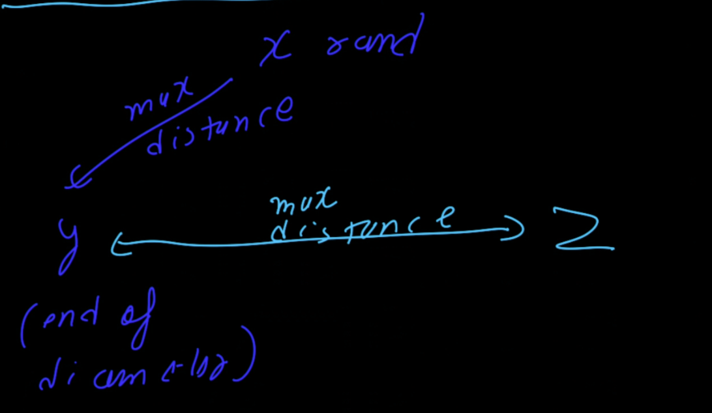
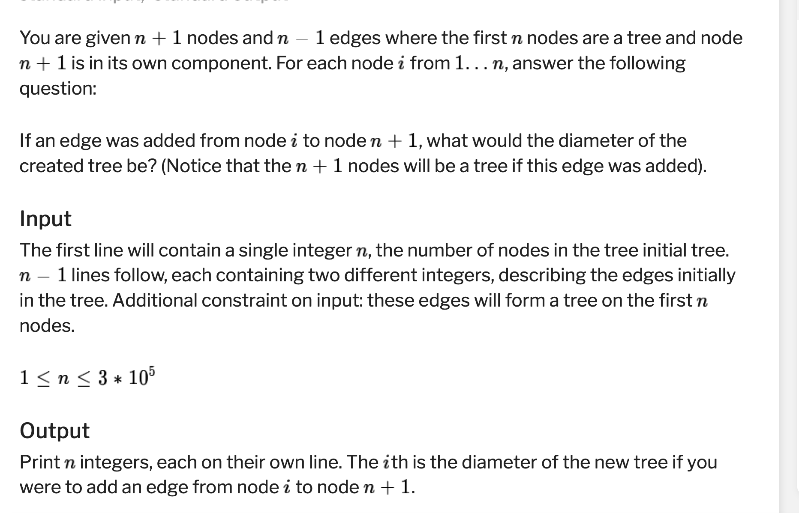
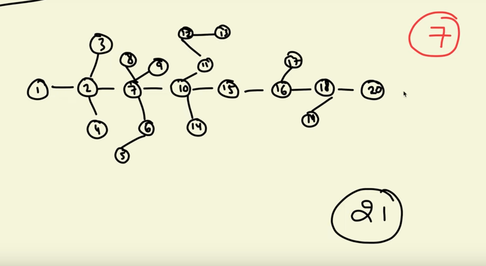
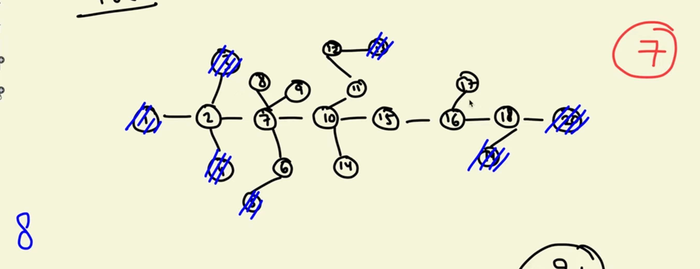
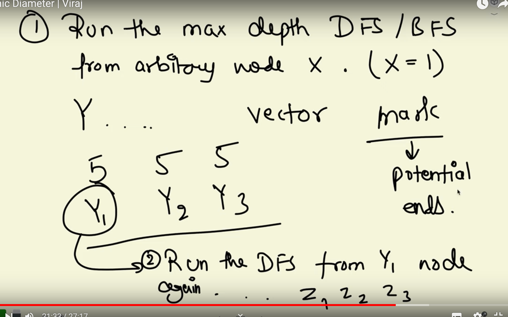

1. take a random node x
2. Do a dfs from x and find which is at max distance from x, call it y.
3. Do a dfs from y and fid a node maxium distance from y, z



```cpp
  ll x=0;
  vl distx(n,0);
  dfs(x,-1,al,distx);
  ll y=-1,maxx=0;
  for(ll i=0;i<n;i++){
      if(distx[i]>maxx){
          y=i;
          maxx=distx[i];
      }
  }
  vl disty(n,0);
  dfs(y,-1,al,disty);
  maxx=0;    
  ll z=-1;
  for(ll i=0;i<n;i++){
      if(disty[i]>maxx){
          z=i;
          maxx=disty[i];
      }
  }
  pri(maxx);
```

```cpp
void dfs(ll node, ll par, vvl &al, vl &dist){
  if(par!=-1) dist[node]=dist[par]+1;
  else dist[node]=0;
  for(ll nei: al[node]) if(nei!=par) dfs(nei,node,al,dist);
}
```


# Queries in diameter

[Problem - B - Codeforces](https://codeforces.com/gym/102694/problem/B)


# Spreading tree about its diameter








```cpp
void dfs(ll node, ll par, vvl &al, vl &dist){
  if(par!=-1) dist[node]=dist[par]+1;
  else dist[node]=0;
  for(ll nei: al[node]) if(nei!=par) dfs(nei,node,al,dist);
}

void solve(){
    iinp(n);
    vvl al(n,vl());
    for(ll i=1;i<n;i++){
        ll u,v;
        inp(u,v);
        u--,v--;
        al[u].push_back(v);
        al[v].push_back(u);
    }

  ll x=0;
  vl distx(n,0);
  dfs(x,-1,al,distx);
  vl ans(n,0);  
  ll p1=max_element(it(distx))-distx.begin();
    for(ll i=0;i<n;i++){
        if(distx[p1]==distx[i]){
            ans[i]=1;
        }
    }    

  ll y=p1,maxx=0;
  vl disty(n,0);
  dfs(y,-1,al,disty);
  maxx=0;    
  ll z=-1;
  for(ll i=0;i<n;i++){
      if(disty[i]>maxx){
          z=i;
          maxx=disty[i];
      }
  }
  ll p2=max_element(it(disty))-disty.begin();
    for(ll i=0;i<n;i++){
        if(disty[p2]==disty[i]){
            ans[i]=1;
        }
    }    
    for(ll i=0;i<n;i++){
        if(ans[i]){
            pri(maxx+1);
        }
        else{
            pri(maxx);            
        }
    }
    pri();
    
}
```

